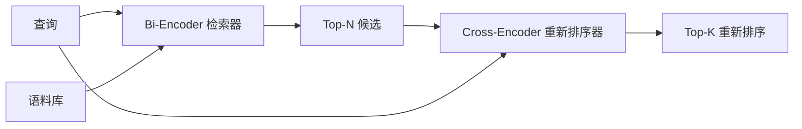

# Cross-Encoder Reranker

> 双编码器（bi-encoder）将查询和文档分别嵌入到相同向量空间。交叉编码器（cross-encoder）则将它们拼接在一起并同时读取。交叉编码器是最“聪明”的阅读器，但也是最慢的。作为双编码器 top-k 的第二阶段使用时，它物有所值。

**Type:** 构建  
**Languages:** Python  
**Prerequisites:** Phase 11 lesson 06 (RAG), Phase 11 lesson 07 (高级 RAG); Phase 19 Track B foundations (lessons 20-29); Phase 19 lesson 65 (为该阶段提供混合检索)  
**Time:** ~90 分钟

## 学习目标
- 区分双编码器检索器（bi-encoder retriever）和交叉编码器重排序器（cross-encoder reranker），通过它们的输入形状、参数量和每次查询的开销来识别差异。
- 从头实现一个小型交叉编码器，作为一个 transformer block，消费打包的（query, document）序列并输出单个相关性标量。
- 连接一个两阶段的 retrieve-then-rerank 流水线：用廉价检索器检索 top-N，用交叉编码器对 N 个候选重排序为 top-K，返回 K 个结果。
- 在一个小的测试语料库上测量延迟与质量的权衡，并在给定延迟预算下选择合适的 N。

## 问题陈述

双编码器将查询和文档映射到同一向量空间并按余弦相似度排序。两者的编码互相独立，互不见面。模型必须把文档中所有有用的信息压缩成一个向量，且对查询不可见。这很快 —— 文档在索引时只需嵌入一次，查询时只需嵌入一次 —— 并且这是在语料规模上进行排序的唯一可行方法。

代价是精度。两个主题相同的文档可能有几乎相同的嵌入，即便只有其中一个回答了查询，而另一个没有，双编码器无法分辨它们。

交叉编码器通过一起读取查询和文档来解决这个问题。模型接收 `[query] [SEP] [document]` 作为单个序列，在拼接处运行全 attention，并产生一个相关性标量。文档中的每个 token 都可以关注查询中的每个 token，模型在完整上下文下决定分数。

代价是吞吐量。双编码器可以对文档嵌入一次并长期使用，而交叉编码器则需要对每个（query, document）对运行一次前向推理。对于一个 1000 万文档的语料库，这意味着每次查询需要 1000 万次前向推理。在请求预算内这是不可行的。

解决方案是分阶段。在第一阶段用双编码器检索 top-N；在第二阶段用交叉编码器对这 N 个候选进行重排序到 top-K。N 很小（50 到 200），交叉编码器的质量提升集中在最重要的部分。总体延迟仍在请求预算内。最终质量是交叉编码器的质量，但受限于双编码器在 N 时的召回率。

## 概念



### 交叉编码器的输入形状

标准打包是 `[CLS] query_tokens [SEP] document_tokens [SEP]`。将 CLS 位置的输出馈入一个线性回归头，输出相关性标量。有些实现使用 mean-pooling 而不是 CLS；差别很小。关键点是模型对每一对输入产生一个标量。

一个 2200 万参数的交叉编码器（公开的 `ms-marco-MiniLM-L-6-v2` 权重类别）是典型的生产点。更小的模型在节省延迟的同时会更快丢失质量。更大的模型（例如 568M 参数的 `bge-reranker-v2-m3`）通常用于离线重排序或第一页重排序（K 很小）的场景。

### 为什么本课训练一个微小模型

真实的交叉编码器是一个微调过的编码器 transformer。在生产中你会加载 checkpoint 并运行它。在本课中目标是展示模型的形状和延迟-质量曲线的形状，而不是训练一个最先进的排序器。因此我们构建一个小的 `nn.Module`，包含一个 transformer block、默认 4 个头的多头注意力、和一个回归头。它用种子进行确定性初始化，这样示例在没有磁盘权重的情况下也可复现。

玩具模型可以从测试语料中学习到正确的形状：相关的查询-文档对在预测分数上高于不相关对。端到端流水线会重排序双编码器的输出，重排序后的 top-K 与黄金标签有相关性。

### 延迟 vs 质量

两阶段流水线有一个可调参数：N。在验证集上把 N 从 5 扫到 100，可以得到如下曲线。

| N | 第二阶段的 Recall@1 | 每次查询的交叉编码器前向次数 | 延迟 |
|---|--------------------|---------------------------------------|---------|
| 5 | 0.62 | 5 | 低 |
| 20 | 0.81 | 20 | 中 |
| 50 | 0.86 | 50 | 高 |
| 100 | 0.86 | 100 | 很高 |

上表数字用于说明形状，不是来自本测试集的精确测量。形状是真实的：通常在 20 到 50 候选之间存在一个“拐点”，重排序带来的提升在该区域达到饱和。过了拐点你就是在白白付费。

从评估曲线和延迟预算中选取 N。交叉编码器不能把召回率提高到超过双编码器在 N 时的召回率，所以较小的 N 会在质量上设限，而不仅是延迟。

## 构建它

`code/main.py` 实现了：

- `CrossEncoder` - 一个小的 `torch.nn.Module`：token 嵌入、一个包含多头注意力和前馈层的 transformer block、平均池化头输出一个标量。
- `tokenize_pair(query, document)` - 将两个字符串打包成单个 id 序列并带有 type ids 标记边界，确定性且使用标准库实现。
- `train_tiny(pairs)` - 在人工标注的 (query, document, relevance) 三元组列表上进行一次有监督训练，使模型在测试集中给出合理的分数。
- `rerank(query, candidates, top_k)` - 生产接口。
- `pipeline(query, retriever, top_n, top_k)` - 两阶段流程。
- 一个演示 `main()`，它从 lesson 65 的模式中加载语料库，检索 top-N，用交叉编码器重排序到 top-K，将两个列表并排打印，并报告每个阶段的延迟。

运行示例：

```bash
python3 code/main.py
```

输出显示双编码器的 top-N、交叉编码器的 top-K 以及时间汇总。交叉编码器每次调用需要更长时间，但不会对整个语料库运行。两阶段总时间保持在请求预算内，同时挑出双编码器排在第二或第三的正确答案。

## 演示会隐藏的失败模式

- 交叉编码器不是对称的。`rerank(q, d)` 和 `rerank(d, q)` 会得到不同的分数。务必将查询放在前面。如果不小心交换，召回率会崩溃。
- N 太小可能看不出问题。如果你设置 N = K，交叉编码器就无法重新排序；它只能重新加权。提升看起来为零。选择 N 至少为 K 的三倍。
- 训练数据泄露到评估中。如果手工标注的训练对包含了评估查询，重排序看起来会像“魔法”。即使在测试语料上也要严格分开训练和评估。
- 生产权重是稠密的。一个 2200 万参数的交叉编码器以 float32 存储约 88MB。承诺 p95 <100ms 之前要规划好模型服务器的内存。
- 批处理很重要。真实的交叉编码器会把 N 个候选放在一个 batch 中运行。本课在 `_batch_encode` 中这样做：构建批次的 id 和 type-id 张量（`torch.tensor(...)`）并运行一次前向。跳过批处理会让延迟按 N 倍增长。

## 使用建议

生产模式：

- 将双编码器、交叉编码器和 N 固定在一起。改变其中任何一个都会使评估失效。
- 用（query, document_id）哈希缓存重排序器的输出。对稳定语料的相同查询会产生相同的重排序；缓存命中可以免费节省延迟。
- 记录 top-1 的交叉编码器分数。若查询的 top-1 分数低于语料特定阈值，则表示域外命中；将其作为“不太自信”信息提交给 LLM。

## 部署事项

Lesson 68 对该两阶段流水线做端到端评估。Lesson 69 将此重排序器放在 lesson 65 的混合检索器之后、答案生成器之前。该重排序器是端到端系统的第二阶段。

## 练习

1. 将 N 从 5 扫描到 50，并绘制重排序输出的 recall@1。找出在本测试集上的拐点。
2. 将交叉编码器训练 10 个 epoch 而不是 1 个。测量每个 epoch 中正负样本对之间的分数差距。
3. 用 CLS-token 头替换平均池化头。比较在该测试集上的收敛情况。
4. 增加第二个交叉编码器头，预测二分类“答案是否在文档中”标签。推理时同时使用两个头：一个用于排序，一个用于阈值判断。
5. 用 lesson 65 的真实双编码器替换确定性模拟检索器并串联两阶段。衡量相对于仅使用双编码器的 top-K 变化。

## 关键术语

| 术语 | 人们如何称呼 | 实际含义 |
|------|-----------------|------------------------|
| Bi-encoder | "向量检索器" | 独立编码查询和文档；按余弦相似度排序 |
| Cross-encoder | "重排序器" | 联合编码（query, doc）；输出一个相关性标量 |
| Two-stage pipeline | "检索并重排序" | 廉价检索器返回 N 个候选，昂贵的重排序器保留 K 个 |
| N (candidate budget) | "重排序池" | 交叉编码器每次查询评分的候选数量 |
| Mean-pooling head | "最后隐藏层平均" | 对编码器最后一层输出取均值得到一个向量 |

## 延伸阅读

- Nogueira, Cho, "Passage Re-ranking with BERT", 2019 — 经典的交叉编码器重排序论文  
- Reimers, Gurevych, "Sentence-BERT: Sentence Embeddings using Siamese BERT-Networks", 2019 — 关于双编码器与交叉编码器的对比  
- [SentenceTransformers Cross-Encoders documentation](https://www.sbert.net/examples/applications/cross-encoder/README.html)  
- [BGE Reranker v2 model card](https://huggingface.co/BAAI/bge-reranker-v2-m3)  
- Phase 19 lesson 65 - 为该重排序阶段提供混合检索的课程  
- Phase 19 lesson 68 - 测量该重排序带来提升的评估课