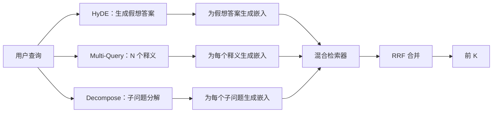

# Query Rewriting: HyDE, Multi-Query, and Decomposition

> 用户输入的查询并不是检索器想要的查询。重写在检索之前搭起桥梁，让索引看到更接近答案的内容。

**Type:** 构建  
**Languages:** Python  
**Prerequisites:** Phase 11 课程 04（嵌入）、06（RAG）；Phase 19 Track B 基础（课程 20-29）；Phase 19 课程 64 和 65  
**Time:** ~90 分钟

## 学习目标
- 实现 Hypothetical Document Embeddings (HyDE)：生成一个假想答案，将其嵌入，并使用该向量进行检索，而不是直接使用查询向量。
- 实现 multi-query 扩展：将一个查询重写为 N 个释义，对每个释义分别检索，然后通过 reciprocal rank fusion 合并排名。
- 实现查询分解：将复杂问题拆分为子问题，对每个子问题分别检索并合并结果。
- 在同一测试语料上对三种重写器进行对比，并解释各策略何时表现最好。
- 编写一个产生确定性、基于测试集输出的 Mock LLM，使重写循环可以脱机运行。

## 问题陈述

用户输入 "what does our team do when uploads fail and the budget is gone?"。语料库中有一条文档写着 "AbortMultipartOnFail aborts an in-flight S3 multipart upload and decrements the per-bucket retry budget when the upload fails"。查询与文档没有共享名词短语，BM25 会漏掉。双编码器（bi-encoder）会把该文档排在第三或第四，因为查询向量落在更偏好“取消任务”的区域，而不是“中止上传”的区域。第 66 课的两阶段重排序器（rerank）如果候选集能包含正确答案则可以救回，但若正确答案连 top-N 都进不去，重排序器就看不到它。

解决方法是在检索之前重写查询。2023 年的论文 "Precise Zero-Shot Dense Retrieval without Relevance Labels"（Gao 等）提出 HyDE：让 LLM 写出能回答该查询的文档（hypothetical document），对该假想文档做嵌入，并用其嵌入作为检索向量。由于假想文档使用了语料库的表述风格，它会落在正确的嵌入空间地区；而原始查询向量没有。

两个亲缘技术与 HyDE 配合使用。Multi-query 扩展（微软 GraphRAG 使用的术语）生成 N 个查询释义，分别检索，然后合并。分解（Stanford DSPy 在 2024 年推广的 "subquery decomposition"）会把 "what does our team do when uploads fail and the budget is gone" 拆成两个问题："what happens when an upload fails" 和 "what happens when the retry budget is gone"。两次检索、合并后两个部分的答案都可达。

本课实现上述三种方法，并在相同测试语料上运行它们。

## 概念图



### HyDE 详解

HyDE 用 LLM 写出的假想文档向量替换用户查询向量。提示词很短：

```
You are a domain expert. Write a one-paragraph passage that answers the question
below. Use the same vocabulary and phrasing the documentation in this domain would
use. Do not refuse. Do not say you do not know.

Question: {user_query}

Passage:
```

LLM 的回答作为事实答案可能是错误的，因为模型并不知道你的语料库。没关系。检索器并不关心事实正确性，只关心词元分布。假想段落会包含 "abort", "multipart", "bucket", "budget" 这些词，因为这是该领域文档会使用的词汇。将该段落嵌入，向量会落在真实段落附近。

在生产环境中你会把假想文档限制为两到三句。更长的假想会带来更多噪声；过短则丢失 HyDE 需要的词汇信号。

### Multi-query 详解

生成 N 个查询释义。最简单的提示词：

```
Rewrite the following question in {N} different ways. Each rewrite must preserve
the original intent. Number them 1 to {N}. Do not add explanations.
```

对每个释义检索 top-k。用 RRF（第 65 课的相同算法）合并 N 个排序列表。成本低、可并行、确定性强。

当用户的措辞只是众多等效提问中的一种，而任一释义都能更好地表达问题时，multi-query 会获胜。当所有释义都同样糟糕（即原始查询本质上有问题）时，它就失败。

### Decomposition 详解

单次检索无法满足多面问题。分解让 LLM 将问题拆成子问题，系统对每个子问题分别检索。提示词：

```
The following question may require information from multiple distinct topics.
Decompose it into a list of sub-questions. Each sub-question must be answerable
independently. If the question is already atomic, return it unchanged.

Question: {user_query}
```

对每个子问题分别检索并合并。对于包含并列、复合从句或两个不相关主题的问题，分解是合适的工具。对于原子问题则不适用；分解器在这种情况下应返回单一问题而不要发明虚假的子问题。

### 三者为何并存

三种方法互补。HyDE 缩小查询与语料的词汇差距；Multi-query 覆盖释义差异；Decomposition 覆盖多主题查询。生产系统通常并行运行三种并为每次查询选择合适策略（第 69 课的端到端系统展示了选择器）。

## Mock LLM

本课为脱机演示。Mock LLM 是基于用户查询的一个小型查找表，并对未见查询使用一个确定性的回退策略。查找表包含：

- 对每个测试查询：一个假想段落、三个释义，以及一个分解结果。
- 对未知查询：一个确定性变换：取查询的内容词，通过同义词表扩展，并返回结果。

Mock 的形状（接口与行为）很重要，数据本身不关键。在生产环境中你会把 Mock 替换为真实模型调用。检索器不变。

## 构建指南

`code/main.py` 实现了：

- `MockLLM` - 上述确定性替代器。
- `HyDERewriter` - 调用 LLM 写出假想文档，返回一个 `RewriteResult`，包含假想文本以及检索器应使用的查询。
- `MultiQueryRewriter` - 调用 LLM 生成 N 个释义，返回查询列表。
- `DecomposeRewriter` - 调用 LLM 进行分解，返回子问题列表。
- `retrieve_with_rewriter` - 接受一个重写器和一个检索器，运行重写并融合结果。
- 一个演示，针对测试语料运行三种重写器并打印哪个策略最先返回金标准答案文档。

检索器结构复用了第 65 课的混合 BM25 + dense 检索器。融合使用相同的 RRF。唯一新增的是重写器接口，它很小巧。

运行：

```bash
python3 code/main.py
```

输出会显示每种策略的排序以及最终总结。HyDE 在措辞不匹配的查询上胜出。Multi-query 在释义多样性的问题上胜出。Decomposition 在多主题问题上胜出。未使用重写器的回退策略在至少一个场景中会落败。

## 演示隐藏的失败模式

- HyDE 会编造特定语料的标识符（hallucinate corpus-specific identifiers）。模型可能发明函数名。假想文档中出现被赋予高权重但不在索引中的新词，导致该文档在 BM25 上分数下降。限制假想文档的长度并在融合时降低其 BM25 权重可缓解此问题。
- Multi-query 生成的所有释义趋同。弱模型可能产生三条高度相似的释义，N 次检索返回相同 top-k，RRF 合并不会优于单次检索。向重写提示中加入明确的多样性指令，并用 Jaccard 检测重复可改进此问题。
- Decomposition 过度拆分。分解器把原子问题拆成列表，检索结果都指向同一文档但排名被削弱，合并结果比原始更差。可在扩散检索之前增加一个“这些子问题是否足够不同”的判定步骤。
- 延迟成倍增加。HyDE 需要一次 LLM 调用。Multi-query 需要一次 LLM 调用生成 N 个释义，然后 N 次检索。Decomposition 需要一次 LLM 调用生成 M 个子问题，然后 M 次检索。检索可以并行；LLM 调用是延迟下限。

## 使用建议

生产模式：

- 按查询长度选择策略：原子短查询用 multi-query，复杂多从句查询用 decomposition，术语密集的查询用 HyDE。
- 将重写器输出按查询哈希缓存。许多查询会重复出现。
- 并行运行三种方法并用 RRF 融合三组结果。成本是 3 次 LLM 调用加一次融合；质量是三种策略覆盖面的并集。

## 上线路线

第 69 课将该重写阶段接入第 65 课的检索器和第 66 课的重排序器。第 68 课评估重写器对检索召回率的提升。

## 练习

1. 实现 RAG-Fusion（2024 年的 multi-query 变体），使重写器生成有意多样化的释义，然后在重排序步骤（第 66 课）选出最终列表。
2. 增加第四种策略：step-back prompting（让 LLM 给出更一般化的问题，对其检索然后再收窄）。在测试语料上比较效果。
3. 训练分解器以识别原子查询，增加一个“问题是否原子”的 head。测量过度拆分率在前后变化。
4. 将 Mock LLM 替换为真实模型调用。测量你栈上每种策略的延迟。
5. 为每个重写输出增加置信度分数。丢弃低于阈值的重写。测量对召回率的影响。

## 关键术语

| Term | What people say | What it actually means |
|------|-----------------|------------------------|
| HyDE | "Fake-document retrieval" | LLM 写出答案；对该假想文档进行嵌入并用其替代查询进行检索 |
| Multi-query | "Paraphrase expansion" | 对查询进行 N 次重写；检索 N 次并用 RRF 合并 |
| Decomposition | "Subquery split" | 将多主题查询拆成子问题，分别检索 |
| Atomic query | "Single-topic" | 无法拆分为子问题而不发明虚假子问 |
| Step-back | "Abstract the query" | 提出更一般化的问题，先检索再收窄 |

## 相关阅读

- Gao, Ma, Lin, Callan, "Precise Zero-Shot Dense Retrieval without Relevance Labels" (HyDE), 2023  
- Microsoft Research, "Multi-Query Expansion for Retrieval"  
- Stanford DSPy, "Subquery Decomposition for Multi-Hop QA"  
- [LlamaIndex query transformations documentation](https://docs.llamaindex.ai/en/stable/optimizing/advanced_retrieval/query_transformations/)  
- Phase 11 lesson 07 - advanced RAG patterns  
- Phase 19 lesson 65 - the retriever this rewriter feeds  
- Phase 19 lesson 68 - the eval that measures the rewriter lift