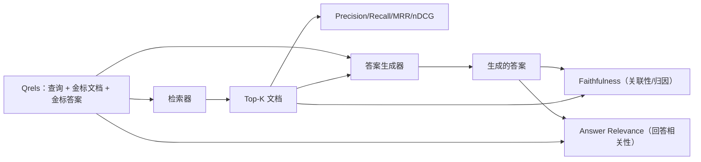

# RAG 评估：Precision, Recall, MRR, nDCG, Faithfulness, Answer Relevance

> 如果你无法同时评估检索和回答，你就无法交付系统。这两者不是同一个度量，而同一个提示在不同维度上会失败。

**Type:** 构建  
**Languages:** Python  
**Prerequisites:** Phase 11 lessons 06 (RAG), 10 (evaluation); Phase 19 Track B foundations (lessons 20-29); Phase 19 lessons 64, 65, 66, 67  
**Time:** ~90 分钟

## 学习目标
- 从金标 qrels 计算四个检索指标：precision@k、recall@k、MRR（平均倒数排名）和 nDCG@k。
- 计算两个回答评分指标：faithfulness（每个断言是否被检索到的上下文支持）和 answer relevance（回答是否切题）。
- 构建一个用于评估的 qrels 固定装置文件（包含查询、金标文档 id、金标答案文本），使评估端到端可运行。
- 阅读指标值以诊断流水线失败的阶段：检索、重排、生成或归因。

## 问题背景

一个 RAG 系统至少有四个活动部件：chunker（分块器）、retriever（检索器）、reranker（重排序器）、generator（生成器）。任一环节都可能导致错误答案。没有分阶段的指标，你就是盲飞。

用户报告错误答案。是因为分块器切断了答案片段？是因为检索器没有在 top-k 中包含该片段？是因为重排序器把正确片段挤出了第一位？还是生成器忽略了片段并虚构了内容？仅凭答案无法判断。你需要：

- 检索指标去评估检索器输出。
- 排序指标去评估正确片段在列表中的位置。
- Faithfulness 去评估生成器是否在检索到的上下文内作答。
- Answer relevance 去评估回答是否真正回答了问题。

本课在一个固定的 qrels 文件上实现全部六个指标。评估是离线且确定性的；在生产中你把模拟的 LLM-as-judge 替换为真实模型。

## 概念



### Precision@k

在检索器返回的 top-k 文档中，有多少比例属于金标集合？如果金标有三个文档，而 top-3 返回了其中两个加上一个错误文档，则 precision@3 为 2 / 3。当检索到的无关片段代价较高（生成器会浪费 token，或片段会污染答案）时，使用 precision。

### Recall@k

在金标文档中，有多少比例出现在 top-k？如果金标有三个文档，而 top-5 包含全部三个，则 recall@5 为 1.0。当漏检答案代价高（你宁愿看到一个额外的错误片段也不要完全漏掉答案片段）时，使用 recall。

在生产 RAG 中，人们通常引用的是 recall@k。生成器很容易丢弃无关片段；但它无法凭空从未见过的片段中“发明”答案。

### MRR（平均倒数排名）

对于每个查询，找到第一个相关文档在排序列表中的位置。倒数排名为 1 / 位置。对查询集取平均。MRR 是检索器将最佳答案放在顶部能力的单值汇总。

MRR 对位置 1 的权重很大。金标文档位于 rank 1 的查询贡献 1.0；rank 2 贡献 0.5；rank 10 贡献 0.1。该指标被列表顶部主导。

### nDCG@k

归一化折现累积增益（Normalized Discounted Cumulative Gain）。完整公式为：给每个检索到的文档赋予一个增益（通常相关为 1、不相关为 0），按位置的对数折现，累加，并除以理想 DCG（如果排名完美时的 DCG）。取值范围 0 到 1。

nDCG 支持分级相关性：金标可以说明“文档 A 是 3，文档 B 是 2，文档 C 是 1”。MRR 和 recall@k 将一切扁平化为二值。若语料中每个查询有多个部分相关文档，使用 nDCG。

### Faithfulness

对生成答案中的每个断言，检查该断言是否被检索到的上下文支持。标准实现使用 LLM-as-judge 的提示：给定（claim，context）返回 yes 或 no。该指标为通过支持判定的断言比例。

Faithfulness 捕捉了生成器“杜撰”内容的失败模式。即便检索器返回了正确片段，一个会产生幻觉的生成器依然是坏的。Faithfulness 也称为 groundedness、support、attribution。

本课用一个确定性的模拟裁判（MockJudge），通过断言与检索上下文之间的 token 重叠阈值来判断支持，以便离线运行。在生产中你可以替换为真实模型调用，指标形状不变。

### Answer relevance

回答是否真正解决了问题？Faithfulness 问的是“回答是否基于检索到的上下文？”。Answer relevance 问的是“回答是否针对查询本身？”。一个 faithful 但偏题的答案在 faithfulness 上得分高，在 relevance 上得分低。一个短小、切题但忽略上下文的回答在 relevance 高、faithfulness 低。

标准实现也使用 LLM-as-judge：给定（question，answer）判断答案是否回答了问题。本课用基于 token 重叠加模拟裁判的替代方案实现。

## 固定的 qrels

```python
{
  "qid": "q1",
  "query": "what is the abort threshold for multipart uploads",
  "gold_doc_ids": ["d1", "d3"],
  "gold_answer_substring": "three failed parts",
  "graded_relevance": {"d1": 3, "d3": 2},
}
```

每个查询包含：
- 查询字符串，
- 一组金标文档 id（用于 precision / recall / MRR），
- 一个分级相关性字典（用于 nDCG），
- 金标答案子串（作为每个 qrel 的参考元数据保留；本课的 faithfulness 是通过判定从答案中抽取的断言对检索到的上下文是否有支持来计算，而不是直接与该子串比较）。

在生产中你需要人工标注这些。此课提供手工构造的固定装置以便评估开箱即用。

## 实现

`code/main.py` 实现了：

- `precision_at_k(retrieved, gold, k)` - 字面定义的 precision@k。
- `recall_at_k(retrieved, gold, k)` - 字面定义的 recall@k。
- `mean_reciprocal_rank(retrieved_list_of_lists, gold_list)` - 对查询取平均的 MRR。
- `ndcg_at_k(retrieved, graded_relevance, k)` - 使用二值或分级增益的 DCG / IDCG。
- `extract_claims(answer)` - 将答案拆分为句子形态的断言。
- `faithfulness(claims, context_texts, judge)` - 被判定为支持的断言比例。
- `answer_relevance(question, answer, judge)` - 判定回答是否切题的裁判。
- `MockJudge` - 确定性的基于 token 重叠的裁判，用于离线评估。
- `evaluate_pipeline(pipeline_fn, qrels, ks)` - 协调器，运行所有指标。
- 一个演示，针对三个流水线变体（分块器基线、混合检索、混合+重排）在 qrels 上运行并打印指标表。

运行：

```bash
python3 code/main.py
```

输出显示每个变体的一张指标表：precision@k、recall@k、MRR、nDCG@k、faithfulness 和 answer relevance。混合检索行在 recall 上优于分块器基线；重排行在 MRR 上优于混合检索。

## 读取指标以诊断失败

| 症状 | 可能原因 | 需要修复什么 |
|------|---------|---------------|
| 低 recall@k，低 precision@k | 分块器切掉了答案或检索器无法找到它 | 分块器边界（lesson 64）或检索器模态（lesson 65） |
| recall@k 尚可，MRR 低 | 正确片段在 top-k 中但不在第一位 | 重排序器（lesson 66） |
| MRR 高，faithfulness 低 | 尽管有正确上下文，生成器仍在虚构内容 | 生成提示；强制“引用或拒绝”策略 |
| faithfulness 高，relevance 低 | 答案有依据但偏题 | 查询重写器（lesson 67）或生成提示 |
| 四个指标都高，用户仍抱怨 | 评估集不具代表性 | 使用真实用户查询扩展 qrels |

## 演示会隐藏的失败模式

**LLM-as-judge 偏差。** 模型会更容易判定自己输出为更有依据。使用与生成器不同族的模型作为裁判，或对样本进行人工标注验证。

**Qrels 失效（rot）。** 随着语料变化，金标答案会发生漂移。某文档在 2024 年 1 月对 q1 是金标，但在 2024 年 10 月由于函数重命名不再正确。安排季度的 qrels 复查。

**Faithfulness 的微观检查漏掉宏观断言。** 逐句的 faithfulness 检查可能通过，但整体答案结构会误导用户。在自动指标之上添加样本级的质性复核。

**Recall@k 掩盖按查询的失败。** 90% 的平均 recall 可能掩盖某类查询总是失败。按查询类别切片（直述、意译、多主题）并报告每片的指标。

## 使用方法

生产模式：

- 在每次检索器或生成器变更时运行评估。把 recall@k 回归当作测试失败对待。
- 为每个查询持久化指标轨迹。当用户抱怨时，查找对应的 qrels 条目，查看是否应已被捕获。
- 对 qrels 分等级：在 CI 中运行的 20 条冒烟集；每夜运行的 200 条回归集；每周运行的 2000 条深度集。

## 上线

Lesson 69 将把整个流水线（分块器、检索器、重排序器、生成器）接线，并用此评估对端到端系统进行打分。

## 练习

1. 添加第五个检索指标：hit-rate@k。将其与 recall@k 比较。解释它们何时不同。
2. 实现分级 faithfulness：0（不支持）、1（部分支持）、2（完全支持）。相应更新指标。
3. 将模拟裁判替换为真实模型调用。测量模拟与真实裁判在固定装置上的分歧。
4. 增加查询类别切片（“literal”、“paraphrased”、“multi-topic”）。报告每一片的指标。
5. 添加“答案长度”指标并与 faithfulness 做相关性分析。绘制曲线。

## 关键词

| 术语 | 常说法 | 实际含义 |
|------|--------|----------|
| Precision@k | "Hit rate over retrieved" | top-k 中为金标的比例 |
| Recall@k | "Hit rate over gold" | 金标中出现在 top-k 的比例 |
| MRR | "First-hit position" | 第一个相关文档排名倒数的平均值 |
| nDCG@k | "Graded ranking quality" | top-k 的 DCG 除以理想 DCG |
| Faithfulness | "Groundedness" | 答案断言中被检索上下文支持的比例 |
| Answer relevance | "Did it address the question?" | 回答是否符合查询意图 |
| Qrels | "Gold labels" | 带标注的查询及其金标文档和答案集合 |

## 深入阅读

- Buckley, Voorhees, "Evaluating Evaluation Measure Stability", SIGIR 2000 - 排序度量的经典论文  
- Jarvelin, Kekalainen, "Cumulated Gain-based Evaluation of IR Techniques" - nDCG 论文  
- [Ragas: Automated Evaluation of RAG Pipelines](https://docs.ragas.io)  
- [Anthropic, Evaluating RAG](https://www.anthropic.com/news/evaluating-rag)  
- Phase 11 lesson 10 - evaluation framework foundations  
- Phase 19 lessons 64-67 - 本文评估的组件  
- Phase 19 lesson 69 - 本评估所打分的端到端流水线