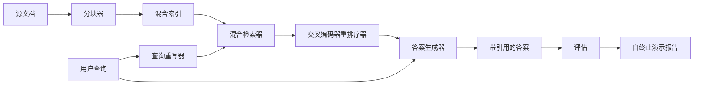

# End-to-End RAG System

> Six lessons of components. One pipeline. One eval loop. One self-terminating demo. This is the system you ship.

**Type:** 构建
**Languages:** Python
**Prerequisites:** Phase 11 lessons 06 (RAG), 10 (evaluation); Phase 19 Track B foundations (lessons 20-29); Phase 19 lessons 64, 65, 66, 67, 68
**Time:** ~90 分钟

## Learning Objectives
- 将 chunker、hybrid retriever、query rewriter、cross-encoder reranker 和 answer generator 组合成一个端到端流水线。
- 实现一个按 chunk 锚点引用其断言的 answer generator，并在置信度低时退回拒答（refuse-on-low-confidence）。
- 对组装好的流水线运行 lesson 68 的 eval，并证明分阶段构建在所有指标上都优于各组件的独立演示。
- 构建一个自终止的 CLI 演示：加载固定语料，运行一组固定查询，并以带有摘要报告的 0 返回码退出。

## The Problem

六个组件各自表现优秀并不能证明系统整体可用。chunker 在语料上的 recall@5 可以很高，但系统的 recall@5 却可能很低，因为 retriever 无法正确排序 chunker 输出的片段。reranker 在合成候选池上可以提升 MRR，但在真实的 bi-encoder 候选上失败，因为 bi-encoder 在重排预算下的召回率太低。query rewriter 可能在一个查询上将金标文档提升到前列，但在下一个查询上因为 LLM mock 返回了退化的假设而崩溃。

集成测试就是在同一组 qrels 和相同指标上对整个流水线进行端到端运行，并用一个协同文件把所有阶段接起来。这就是本课要构建的内容。如果集成流水线的指标优于每个阶段的独立演示，你就证明了系统的有效性。

## The Concept



### Wiring choices

流水线是一个小型有向图。每个阶段都是一个具有清晰签名的函数。

| Stage | Input | Output |
|-------|-------|--------|
| Chunker | Document text | List of Chunk records |
| Retriever | Query string | Top-N Chunk records |
| Rewriter (optional) | Query string | List of rewrites + hypothetical |
| Reranker | Query, candidates | Top-K Chunk records with cross scores |
| Generator | Query, top-K Chunk records | Answer string with citations |

当每个签名稳定时，组合非常直接。课程中的 `Pipeline` 类持有这五个阶段并提供一个按顺序运行它们的 `query` 方法。每个阶段都是可替换的：传入不同的 chunker、retriever、rewriter、reranker 或 generator，流水线仍然可以运行。

### Answer generator with citations

generator 是最后一个阶段，也是最容易出问题的。课程提供了一个确定性的 mock generator，它：

1. 接收 top-K 重排序后的 chunks。
2. 选择至多两个与查询在内容 token 上重合度最高的 chunks。
3. 输出一个由每个被选 chunk 的一句话拼接而成的答案，每句后跟随一个以 `[doc_id:chunk_index]` 形式的锚点。
4. 如果没有任何 chunk 的重合度高于拒绝阈值，则输出 "I do not know"（不答）且不附带引用。

在生产环境中，你可以将 mock 替换为带有如下提示模板的真实 LLM 调用：

```
你只能使用下面的片段来回答问题。
请用括号内的锚点引用所有断言。
如果这些片段不能回答问题，请说 "I do not know"。

问题: {query}

片段:
{带锚点的枚举片段}

回答:
```

拒答路径（refuse-on-low-confidence）就是记录交叉编码器 rank-1 分数的整个理由。如果该分数低于语料阈值，generator 会拒答。这是防止幻觉回答的安全阀。

### The self-terminating demo

演示会端到端运行所有内容。它会打印单个查询的每个阶段分解，使用四个固定 qrels 运行 eval，打印指标表格，并且如果所有 lesson 68 指标都满足演示设定的阈值则以状态码 0 退出。若任一指标低于阈值，演示将以非零状态码退出并输出指明失败指标的消息。

这就是 CI 烟雾测试（smoke test）的形状。流水线离线运行、快速且确定。阈值在 fixture 上特意设得很严，以便任何一个阶段的回归都会导致演示失败。

## Build It

`code/main.py` 实现了：

- `Chunk` - 在所有阶段中传递的记录（在 lesson 64 的结构基础上扩展，包含 chunk_index 和 source doc_id）。
- `Chunker` - 从 lesson 64 选择策略（默认递归拆分）。
- `HybridIndex` - 将 lesson 65 的 BM25 + dense + RRF 封装在一起。
- `Rewriter`（可选） - 根据查询长度和连词存在与否，从 lesson 67 的 HyDE、multi-query、decomposition 中择一。
- `Reranker` - lesson 66 中训练好的交叉编码器，使用一个更小的 fixture 训练集以便在几秒内收敛。
- `Generator` - 带引用并在低置信度时拒答的确定性 mock generator。
- `Pipeline` - 将五个阶段组合在一起，提供 `query(question)` 方法，返回 `Result(answer, top_k, latency_ms_per_stage)`。
- `run_demo()` - 加载语料，运行三个固定查询，运行 eval，打印结果，并根据阈值设置退出码。

运行：

```bash
python3 code/main.py
```

输出包含一次打印的查询追踪、完整的 eval 表，以及最终的通过/失败状态。在 fixture 上返回码为 0。

## Failure modes the demo will hide

**Chunker boundary drift（分块边界漂移）。** 如果你在 eval qrels 标注阶段和演示之间切换了 chunker 策略，金标 doc id 将不再对齐。请在 qrels 文件中锁定 chunker 策略。演示包含一个头部，说明所用的 chunker。

**Reranker training set leaks into the eval（重排序训练集泄漏到评估）。** lesson 66 中的 14 个训练三元组包含与 eval 查询相似的查询。在生产中，应严格保留 eval 查询。演示的 eval 查询刻意与 rerank 训练集不相交。

**Mock generator hides hallucination risk（Mock generator 隐藏了幻觉风险）。** mock 无法产生幻觉，因为它仅输出检索到的 chunks 的文本。课程指出了这一点，并指明了替换为真实模型的路径。

**No streaming（无流式输出）。** 流水线在每个阶段结束时返回完整答案。生产系统会对 generator 的输出进行流式传输。流式输出超出本课范围；无论是否流式，答案级别的评价指标都基于最终字符串。

**Latency is offline（延迟为离线）。** mock LLM 调用为常数时间。真实 LLM 调用将成为主导。请在请求范围内规划延迟预算；本课按阶段计时只度量 CPU 工作时间。

## Use It

生产实践：

- 将流水线文件作为一个带有显式阶段接口的单一协调器文件部署。避免将连线（wiring）分散在仓库各处。
- 在每次触及某个阶段的合并前运行 eval。如果 eval 指标下降，合并不应落地。
- 持久化每次 CI 运行的指标轨迹，以便将回归归因到某个阶段替换。
- 添加一个 20 条查询的烟雾集（回归集合的子集），在 30 秒内运行完成；完整回归集合可夜间运行。

## Ship It

本课的流水线文件是后续 Phase 19 Track F 课程所假定的形状。后续课程会增加摄取自动化、增量重建索引、遥测和部署层。此处检索、重排、重写和评估的半边已经完整。

## Exercises

1. 在 rewriter 内添加按查询选择策略的逻辑：用 lesson 67 的启发式（长度、连词、术语比率）在 HyDE、multi-query 和 decomposition 之间选择。
2. 在 env 开关下为 generator 添加真实 LLM 调用。默认使用 mock。测量延迟差异。
3. 扩展演示以接受 `--corpus path` 标志以加载真实语料。重新运行 eval 并进行阈值检查。
4. 为 chunker 添加 `--strategy` 标志。测量每种策略对端到端召回率的贡献。
5. 添加流式 generator 接口并将其接入 eval。确认忠实度（faithfulness）是在最终字符串上计算，而非流式前缀。

## Key Terms

| Term | What people say | What it actually means |
|------|-----------------|------------------------|
| Pipeline | "RAG pipeline" | 从摄取到带引用答案的组合阶段 |
| Citation anchor | "Source link" | 附加到每个断言上的 (doc_id, chunk_index) 引用 |
| Refuse-on-low-confidence | "I do not know" | 当 reranker top-1 分数低于阈值时，generator 返回不答 |
| Smoke set | "CI eval" | 在每次 PR 检查中运行的最小 qrels 子集 |
| Stage interface | "Function signature" | 每个流水线阶段的稳定输入输出类型 |

## Further Reading

- [Anthropic, Building search and retrieval](https://www.anthropic.com/news/contextual-retrieval)
- [Pinterest, MCP internal search](https://medium.com/pinterest-engineering) - 生产架构参考
- [Ragas: Automated Evaluation of RAG Pipelines](https://docs.ragas.io)
- Phase 11 lesson 06 - RAG fundamentals
- Phase 19 lessons 64-68 - the components composed here