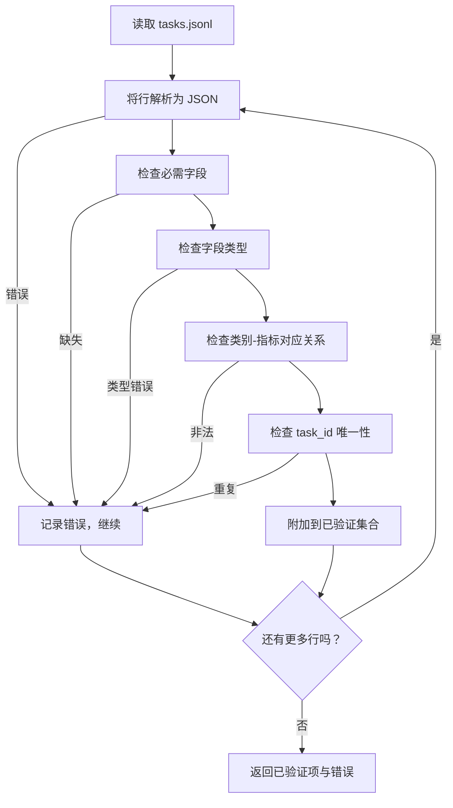

# Task Spec Format

> An eval harness is only as good as the contract its tasks honour. Freeze the JSONL shape and the metric vocabulary before you write a single scoring function.

**Type:** Build  
**Languages:** Python  
**Prerequisites:** Phase 19 Track B foundations  
**Time:** ~90 分钟

## 学习目标

- 定义一个 JSONL 任务记录模式，能够在一个结构中覆盖算术、选择题、多选题、代码执行、分类和自由文本摘要。
- 固定一个封闭的指标名称词表，以便下游课程（71-73）可以在单一字段上进行调度。
- 将少样本示例和后处理规则作为任务的一部分而非运行器的一部分指定，这样相同的提示词在不同模型上产生相同的目标。
- 实现一个严格的验证器，在记录到达运行器之前拒绝格式错误的记录。
- 提交一个包含 10 个任务的夹具集合，覆盖规范的每一个分支，以便验证器有真实的样本可供检测。

## 为什么要冻结规范

研究代码库会比测试更快地积累评估脚本。六个月后，每个笔记本都有自己的 JSON 结构，每个指标被重复实现两次，且无法跨运行进行比较。解决办法很无聊：选一个模式，写一个验证器，拒绝所有其他形式。这就是本课的目的。

该形状借鉴了 BIG-bench、HELM 和 lm-eval 风格的想法，但字段名称是我们的。每个字段都有唯一的负责人。运行器读取任务。指标读取目标。后处理步骤规范化生成内容。没有字段在流水线中间是可变的。

## 记录格式

一个任务是单行的 JSON 对象。运行器读取 `tasks.jsonl` 并独立验证每一行。错误的行会中止该记录，但不会中止整个运行。

```json
{
  "task_id": "arith_001",
  "category": "arithmetic",
  "prompt": "Compute the result. Question: 17 + 24\nAnswer:",
  "targets": ["41"],
  "metric_name": "exact_match",
  "few_shot_examples": [
    {"prompt": "Question: 2 + 2\nAnswer:", "completion": "4"}
  ],
  "post_process": "strip_whitespace",
  "metadata": {"difficulty": "easy"}
}
```

必需字段为 `task_id`、`category`、`prompt`、`targets`、`metric_name`、`post_process`。`few_shot_examples` 和 `metadata` 为可选。未知的顶层字段会导致验证失败。

## 字段规则

`task_id` 是不含空白的字符串。验证器会强制整个文件中的唯一性。

`category` 必须是下列之一：`arithmetic`、`mcq`、`code_exec`、`classification`、`summary`。类别会约束允许的指标和后处理配对。`code_exec` 任务必须使用 `metric_name = code_exec`，`mcq` 任务必须使用 `metric_name = exact_match` 并针对单字母目标。

`prompt` 是非空字符串。验证器禁止尾部空白，并拒绝已经在提示体内包含少样本块的记录。少样本渲染发生在运行器中，而不是作者在提示中包含。

`targets` 是非空字符串列表。对于 `exact_match`，任意匹配元素均计为命中。对于 `f1` 和 `rouge_l`，取最高得分的目标。对于 `mcq`，列表恰好包含一个元素。

`metric_name` 必须是下列之一：`exact_match`、`f1`、`bleu_4`、`rouge_l`、`accuracy`、`code_exec`。该词表是封闭的。新增指标需要新增一课并在此处添加该项。

`few_shot_examples` 是一组 `{prompt, completion}` 对。验证器将列表长度上限设为 8 条以保持提示的界限。

`post_process` 必须是下列之一：`none`、`strip_whitespace`、`lower`、`extract_letter`、`extract_code_block`、`extract_first_line`。每条规则具有单一确定性行为。验证器禁止组合规则。

## 验证器行为



验证器返回两个列表：已验证记录和错误记录（包含出问题的行、违反的规则以及出错字段）。如果错误列表非空且未显式设置 `--allow-bad-tasks` 标志，运行器拒绝启动。

## 少样本渲染

运行器在提示前将少样本示例串联起来，使用一个空行作为分隔符。相同的代码路径对每个模型均相同，因此唯一的差异来源是模型本身。作者只需写一次示例，而不是为每个提供商各写一次。

```python
def render(task):
    parts = []
    for ex in task.get("few_shot_examples", []):
        parts.append(ex["prompt"] + " " + ex["completion"])
    parts.append(task["prompt"])
    return "\n\n".join(parts)
```

## 后处理规则

后处理步骤在生成之后、指标计算之前运行。它是确定性的且无状态的。

- `none` 返回字符串不变。
- `strip_whitespace` 去除前后空白。
- `lower` 转为小写。
- `extract_letter` 返回与 `[A-E]` 匹配的第一个字符，用于 MCQ。
- `extract_code_block` 返回第一个三反引号围栏代码块的主体，用于 code-exec。
- `extract_first_line` 返回第一行非空行，用于摘要分类。

需要该列表之外规则的任务应被放入新课中。

## 本课不做的事

它不做评分。不调用模型。不运行代码。这些内容在课程 71、72 和 75 中完成。本课冻结了所有这些组件必须遵守的契约。

这个 10 任务的夹具覆盖了两个算术项、两个 MCQ 项、两个 code-exec 项、两个分类项和两个摘要项。验证器通过所有 10 项。一个单独的夹具（`tasks_bad.jsonl`）会触发每一条规则，验证器返回恰好那么多错误。

## 如何阅读代码

`main.py` 定义了 `TaskSpec`、`validate_task`、`validate_file` 和一个 CLI 入口点。夹具加载器是 `load_fixtures`。渲染和后处理辅助函数与验证相邻，以便课程 75 的运行器只需导入单个模块。

自上而下阅读 `main.py`。然后阅读 `code/tests/test_spec.py`。测试固定了每条验证规则和每个后处理行为。`main.py` 底部的演示验证了捆绑的夹具并打印摘要。

## 进一步发展

真正的评估套件像模式添加列那样扩展类别。稳健的做法是在不同时添加类别的同时也必须添加一个指标、一个后处理规则以及至少一个夹具任务。将规范视为数据库迁移。每次更改都需审核、版本化并附带测试。本课中的验证器就是门禁。