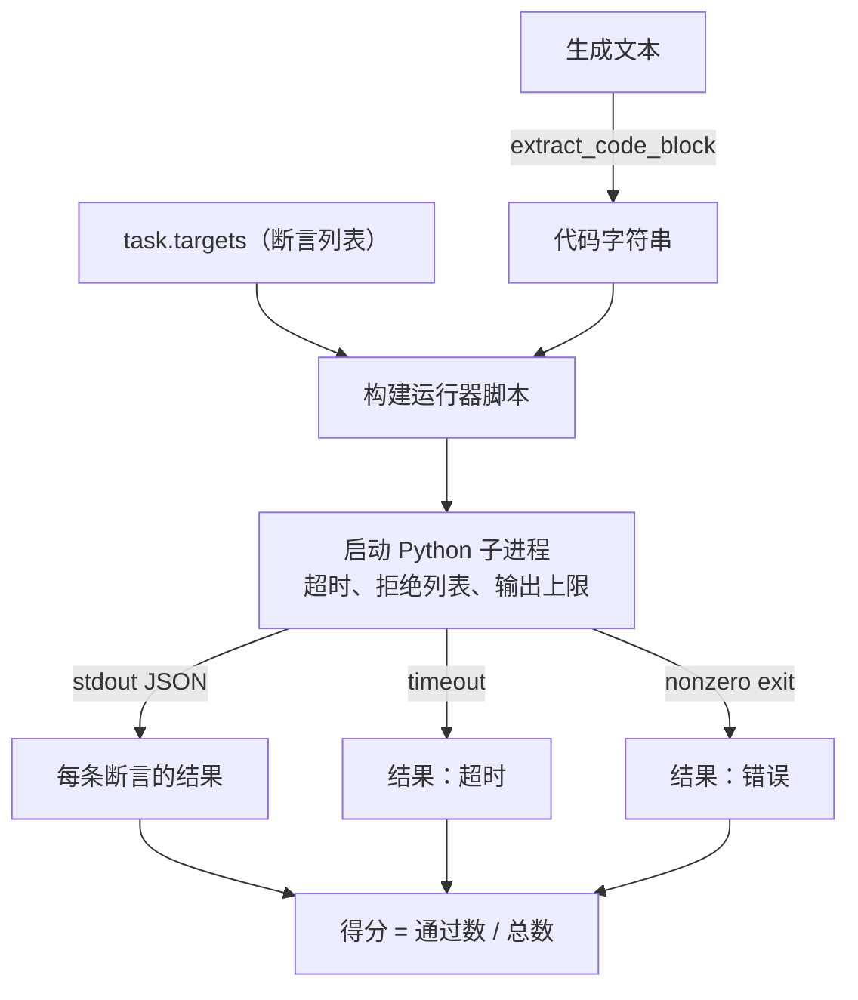

# Code Exec Metric

> 生成的代码只有在通过测试时才算正确。评估工具必须从生成文本中提取代码、在不让宿主崩溃的情况下运行它，并诚实地统计通过率。本课建立这个表面能力。

**Type:** 构建  
**Languages:** Python  
**Prerequisites:** 第 19 阶段 Track B 基础，课程 70 和 71  
**Time:** ~90 分钟

## 学习目标

- 以与课程 70 的后处理规则匹配的方式，从自由形式的生成中提取代码块。
- 在隔离的子进程中执行候选代码，并提供墙钟超时、输出上限和导入拒绝列表。
- 将任务计分为对候选代码通过的断言字符串的比例。
- 计算在对同一模型采样多次时的 pass-at-k。
- 将沙箱崩溃、语法错误和超时视为一等公民失败模式，并为运行器记录不同的退出码。

## 为什么要使用隔离子进程

内联的 exec 是安全性和稳定性的隐患。生成的 `while True: pass` 会永远阻塞评估。生成的 `import shutil; shutil.rmtree('/')` 的破坏性不言而喻。解决办法是为每个候选生成新的 Python 解释器，从 stdin 传入代码，把断言结果写到 stdout，并在超时后终止该进程。宿主评估进程继续运行。

真实的评估（如 HumanEval、MBPP、BigCodeBench、LiveCodeBench）都使用子进程沙箱。有些会在其上再加一层 Docker。我们在子进程处止步是有原因的：它可移植、依赖标准库，并且能捕获教育评估中重要的失败模式。生产部署还会加上 seccomp、网络隔离和只读文件系统。本轨道外的下一课讨论加固策略。

## 代码执行任务的形态

一个 `code_exec` 任务会在 `targets` 中携带断言字符串。运行器从生成中提取一个带围栏的代码块，围绕它构建测试驱动脚本，并运行结果。



得分是一个在 `[0, 1]` 之间的小数。例如有三个断言、两个通过则得分为 0.667。无论发生何种失败，运行器返回的结构保持相同：子进程崩溃会被映射为规范化的错误码，而不是把 Python 回溯冒泡到宿主。

## 拒绝列表

拒绝列表基于导入。在运行候选代码之前，运行器脚本会重写对危险模块的导入为抛出 `ImportError("denied")` 的存根。该列表故意保守：`os.system`、`subprocess`、`socket`、`requests`、`urllib`、`urllib.request`、`urllib.error`、`urllib.parse`、`ctypes`、`shutil`、`http.client`、`asyncio.subprocess`。

我们并不假装这能万无一失。决心足够强的对抗性代码可以绕过任何进程内的沙箱。拒绝列表只是最后一道防线。墙钟超时和输出上限才是承重的控制手段。

```python
DENIED = {
    "os.system": True,
    "subprocess": True,
    "socket": True,
    "shutil": True,
    "requests": True,
    "urllib": True,
    "ctypes": True,
}
```

我们通过在候选代码前面添加 `import sys` 和一个守护代码来包装它，该守护会对 `os.system` 进行猴子补丁使其抛出异常。完整模板位于 `main.py`。

## 墙钟超时

每个子进程默认有 3 秒的实际墙钟时间预算。运行器使用 `subprocess.run(..., timeout=t)`。如果触发超时，运行器捕获 `TimeoutExpired`，终止进程，并记录该任务的 `timeout` 退出原因。该任务的得分为零。运行器继续处理下一个任务。

可以通过 `task.metadata.timeout_s` 为每个任务配置超时。长时间运行的单元测试可以请求更长时间；课程 70 的验证器将该值上限限制为 30 秒以保持测试套件的有界性。

## 输出上限

子进程可能会泛滥 stdout，耗尽宿主内存。运行器将 stdout 流式写入缓冲区，并在实时总量超过 256 KB 时立即终止子进程。结果被记录为 `exit_code = error`，细节字符串为 `"output overflow"`。这在生成的代码不小心写入一个打印的无限循环时会出现。

## Pass-at-k

Pass-at-k 是 HumanEval 等使用的无偏估计器。给定每个任务独立采样的 n 个样本和 c 个通过样本，从这 n 个中抽取 k 个样本时至少包含一个通过解的概率为：

```
pass_at_k(n, c, k) = 1 - C(n - c, k) / C(n, k)
```

当 `n - c < k` 时，分子未定义且值为 `1`。实现会直接处理该边界情况。我们对排行榜层（课程 74）暴露 `pass_at_k(n, c, k)`。

```mermaid
flowchart LR
    A[任务，n=10 个样本] --> B[运行每个样本]
    B --> C[c 个样本通过]
    C --> D[pass_at_1 = c/n]
    C --> E[pass_at_5 = 1 - C(n - c, 5) / C(n, 5)]
    C --> F[pass_at_10 = 1 若 c>0 否则 0]
```

## 退出码

对于每个任务，运行器返回五种结果之一：

- `pass` 当所有断言都通过时。
- `assertion_fail` 当代码运行但至少有一个断言失败时。
- `syntax_error` 当代码无法导入或出现 SyntaxError 时。
- `timeout` 当墙钟时间耗尽时。
- `error` 其他任意崩溃，包括拒绝列表命中和输出溢出（溢出在细节中以 `"output overflow"` 呈现）。

得分仍然是一个分数。退出码是元数据。下游课程可以决定将超时计为零分还是视为缺失数据。

## 本课不做的事

它不会为你提供一个真正的沙箱。它不会运行来自开放网络的不受信任代码。它不处理有状态任务，例如文件 I/O 或网络调用。那些需要容器或微型虚拟机。本课的要点是契约：一个隔离的子进程、一个拒绝列表、一个超时、一个输出上限、一个清晰的退出码词汇表，以及 pass-at-k 的计算。

## 如何阅读代码

`main.py` 定义了 `extract_code`、`run_candidate`、`score_code_exec` 和 `pass_at_k`。子进程运行器脚本作为字符串构建并以 `-c` 传给一个新的 Python 解释器。`code/tests/test_exec.py` 中的测试针对 HumanEval 风格的示例检验了四种退出码以及 pass-at-k。

自上而下阅读 `main.py`。运行器模板是承重部分。盯着断言循环看，直到你能预测它写回父进程的 JSON 包装结构。

## 进一步发展

一旦子进程形态可用，下一个关注点是可移植性。不同的 Python 版本在 Windows 上对 SIGKILL 的处理不同。最干净的解决方案是把运行器放入 Docker 镜像。其后是用真实的单元测试文件替换断言字符串，使评估与生产 CI 保持一致。到那时就别再把断言字符串称为测试了；它们只是玩具测试，且有玩具式的失败模式。