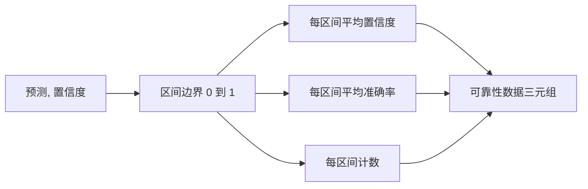

# 困惑度与校准

> 如果你的模型在一千个回答上都宣称有 90% 的置信度，但只有六百个是正确的，那么它的校准不好。校准是可信评估的一半。另一半是困惑度（perplexity），它告诉你模型是否认为留出文本根本是合理的。

**Type:** 构建  
**Languages:** Python  
**Prerequisites:** Phase 19 Track B 基础，课程 70 和 71  
**Time:** ~90 分钟

## 学习目标

- 从适配器提供的 token 负对数概率中计算留出语料的 token 级别困惑度。
- 从按置信度分箱的预测概率中计算分类器或多项选择评估的期望校准误差（ECE）。
- 计算 Brier 得分（关于正确性的指示函数的均方误差）并解释它在何种情况下弥补了 ECE 的不足。
- 构建绘制置信度-准确率曲线所需的可靠性图数据。
- 将以上三项与评估运行器接线，使其能够在模型报告上附加 `perplexity`、`ece` 和 `brier` 数值。

## 困惑度告诉你的是什么

困惑度是每个 token 指数化的平均负对数似然（negative log-likelihood）。数值越低越好。困惑度为 1 表示模型为每个实际 token 分配了概率 1。困惑度等于词表大小意味着模型是均匀分布、没有学到任何东西。真实数值介于两者之间：一个强大的 2026 年基线模型在 WikiText-103 上大约处于 8 到 12。糟糕的模型在相同文本上则在 50 以上。

评估框架本身不计算对数概率。这些来自模型适配器。框架只做汇总：它接受按 token 的负对数概率列表、每个序列的 token 数列表，并返回语料的困惑度。

```python
def perplexity(neg_log_probs, token_counts):
    total_nll = sum(neg_log_probs)
    total_tokens = sum(token_counts)
    return math.exp(total_nll / total_tokens)
```

实现会处理零 token 的边缘情况，并断言负对数概率是非负的。常见错误是忘记取负号：一个返回 `log p` 而不是 `-log p` 的适配器会产生小于 1 的困惑度，这是不可能的。该函数将此类情况视为契约违例并捕获。

## ECE 测量的内容

期望校准误差将预测按置信度分组到固定数量的区间中，然后衡量每个区间中置信度与准确率之间差距的平均值，按区间大小加权。

```mermaid
flowchart TD
    A[带置信度 p 和正确性 y 的 N 个预测] --> B[按 p 分箱为 M 个区间]
    B --> C[对每个区间计算平均置信度和平均准确率]
    C --> D[差距 = |平均置信度 - 平均准确率|]
    D --> E[按区间大小 / N 加权]
    E --> F[ECE = 加权差距之和]
```

标准公式在 [0, 1] 区间上使用十个等宽区间。实现支持任何正整数区间数。我们暴露了 `bins` 参数，以便运行器可以在出版惯例（10）与比较惯例（15）之间选择。

ECE 会受到区间数和样本量的偏差影响。使用十个区间和一百个预测时，你无法将 0.02 的 ECE 与随机噪声区分开来。实现会返回已填充的区间数以及 ECE，以便运行器在样本过少时拒绝只报告一个数字。

## Brier 得分弥补 ECE 的不足

ECE 只关心平均差距。一个在一半区间上过于自信而在另一半区间上过于保守的模型可能在全局上有低 ECE，但在局部仍然校准很差。Brier 得分按预测对真实结果的平方误差进行惩罚，因此它会直接惩罚误差的分散性。

对于二元结果，Brier 是 `mean((p_i - y_i)^2)`。它可以分解为可靠性（reliability）、分辨率（resolution）和不确定性（uncertainty）。我们会计算分数和分解。运行器报告标量，但会将分解记录到仪表盘日志中。

```python
def brier(p, y):
    return float(np.mean((p - y) ** 2))
```

## 可靠性图数据

可靠性图在每个区间内绘制预测置信度与经验准确率。对角线表示完美校准。该函数返回三个数组：每区间平均置信度、每区间平均准确率和每区间计数。绘图代码在下游；本课只到数据形状为止。



返回的元组正是调用层绘制图或计算自定义 ECE 变体（自适应 ECE、扫掠 ECE 等）所需的。我们返回 numpy 数组，以便下游代码无需转换。

## 置信度来源

框架并不假设置信度来自 softmax。它接受每个预测的任意位于 [0, 1] 的数值。对于多项选择任务，自然的置信度是「对选项对数似然的 softmax」。对于自由文本，自然的置信度是模型自报的概率或平均对数似然的指数。评估只消费这个数值，其来源由适配器负责。

## 边缘情况

- 所有预测都错：ECE 是平均置信度，Brier 很高，困惑度取决于模型对文本的估计。
- 所有预测都正确并且置信度很高：ECE 接近零，Brier 接近零。
- 完全不确定的预测器 p=0.5：ECE 是 0.5 减去准确率，Brier 是 0.25 减去一个修正项。
- 空输入：ECE、Brier 和可靠性返回 `0.0`（或填零的数组）。零 token 情况下困惑度返回 `NaN`。这些路径都不发出警告；运行器检查这些数值并决定是否报告或跳过。

这些情况已写入测试。真实模型在真实基准上通常不会触及这些情况，但错误的适配器或样本量非常小的情况会遇到，运行器不应崩溃。

## 调度（Dispatch）

校准不是像 F1 那样的逐任务指标。它是逐模型报告的。运行器在整个评估过程中累积 `(confidence, correct)` 对，然后只计算一次 ECE、Brier 和可靠性数据。困惑度在一个留出的文本语料上计算，独立于逐任务评分。

接口是：

```python
report = CalibrationReport.from_predictions(confidences, correct)
report.ece          # float
report.brier        # float
report.reliability  # tuple of three numpy arrays
report.populated_bins  # int
```

`PerplexityResult.from_token_nll(neg_log_probs, token_counts)` 返回困惑度和每个 token 的平均负对数似然。

## 本课不做的事情

它不调用模型。它不实现 softmax。它不从输出 token 估计置信度；那是适配器的职责。它不做温度缩放或 Platt 缩放；这些是后处理的修正，属于另一课。本课的要点是使这三个数值（perplexity、ECE、Brier）可被信任且可复现。

## 如何阅读代码

`main.py` 定义了 `perplexity`、`expected_calibration_error`、`brier_score`、`reliability_diagram`，以及 `CalibrationReport` / `PerplexityResult` 数据类。演示在合成预测上运行，真实标注已知：一个校准良好的模型、一个过于自信的模型和一个过于保守的模型。`code/tests/test_calibration.py` 中的测试固定了每个边缘情况以及合成预测器的参考值。

从 `main.py` 从上到下阅读。函数顺序从标量到向量再到报告。每个函数都有简短的 docstring，说明数学含义和契约。

## 拓展

校准是发表评估中最被忽视的维度。大多数排行榜只报告单一的准确率并认为任务完成。一个在准确率上获胜但在 Brier 上表现糟糕的模型，比起一个准确率低几分但可靠地报告不确定性的模型在生产部署中更差。一旦你有了校准的管道，就在一个留出的验证切片上加入温度缩放，重新计算 ECE，看差距如何缩小。那是另一课的内容，但基线工作就来源于这里。