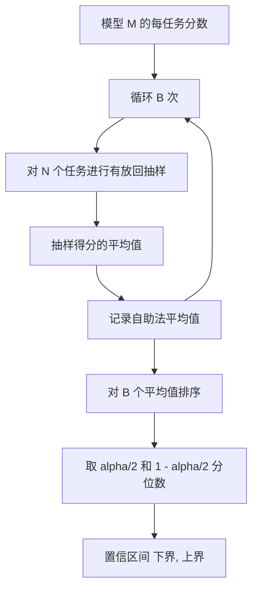

# Leaderboard Aggregation

> 每个任务的分数很简单。在异构任务上对模型进行排名更难。对一个包含数千个预测的排行榜进行统计显著性检验是大家常常跳过的部分。本课不会跳过它。

**Type:** 构建
**Languages:** Python
**Prerequisites:** Phase 19 Track B 基础知识，lessons 70、71、73
**Time:** ~90 分钟

## 学习目标

- 将多个模型在多个任务上的每任务分数聚合为每模型一行的整洁表格。
- 对异构分数进行归一化，避免通过率和 BLEU 值在汇总中占据过大权重。
- 按平均值和按胜率对模型排序，并解释何时使用各自的汇总方式更合适。
- 对每个模型的平均分以及成对差异计算自助重采样（bootstrap）置信区间。
- 输出排行榜为 JSON 报告和可粘贴到 CI 评论中的 Markdown 表格。

## 输入形状

聚合器消费一个 `EvalRun` 记录列表：

```python
@dataclass
class EvalRun:
    model_id: str
    task_id: str
    metric_name: str
    score: float          # 在 [0, 1] 之间
    category: str
```

lesson 75 中的 runner 为每个 `(model, task)` 对发出一条记录。聚合器不关心分数如何生成。它期望归一化已经发生：每个分数都处于 `[0, 1]`。

## 输出

会产生三个表：

```mermaid
flowchart LR
    A[EvalRun 列表] --> B[每任务透视表 (模型 x 任务)]
    B --> C[每模型平均分]
    B --> D[每模型胜率]
    C --> E[均值的自助法置信区间]
    D --> F[差异的成对置信区间]
    E --> G[排行榜行]
    F --> G
    G --> H[JSON + Markdown 表格]
```

排行榜行包含：`model_id`、`mean_score`、`mean_ci_lo`、`mean_ci_hi`、`win_rate`、`tasks_completed`，以及可选的用于每类别平均值的 `categories` 字典。

## 归一化

如果一个任务的分数在 `[0, 1]`，另一个任务在 `[0, 100]`，第二个任务会在均值上悄然主导结果。聚合器会验证每个输入分数是否在 `[0, 1]` 范围内，否则拒绝该运行。修复应在上游进行：度量应直接返回一个分数比例。lessons 71 到 73 强制执行该约定。

## 平均值和胜率

这两种排名方案用于不同的目标。

平均分是一个模型对每任务分数的平均值。它是排行榜通常报告的头条数字。它对离群值和任务不均衡敏感。

胜率统计模型在相同任务上击败所有其他模型的频率。对于每个任务，分数最高的模型胜出（并列时平分）。胜率等于胜次数除以模型有分数的任务数量。它对离群值和尺度差异不那么敏感，但会丢失一些信息。

```python
def win_rate(model_id, runs_by_task, all_models):
    wins, total = 0, 0
    for task_id, runs in runs_by_task.items():
        scores = {r.model_id: r.score for r in runs if r.model_id in all_models}
        if model_id not in scores:
            continue
        total += 1
        best = max(scores.values())
        if scores[model_id] >= best:
            wins += 1
    return wins / total if total else 0.0
```

绑定器会同时报告两者。lesson 75 中的 runner 默认按平均值排序；Markdown 表格中也会包含胜率这一列，以便用户偏好使用胜率时查阅。

## 自助重采样置信区间

每模型的均值伴随一个由自助重采样估计的置信区间。我们对任务 id 进行有放回重采样，计算重采样集合上的均值，重复 B 次，并取置信水平 alpha 的分位区间。



对于成对比较，我们对每任务差值 `score_A - score_B` 进行自助重采样，取得分位区间并报告。用户据此判断区间是否不包含零。如果不包含零，则差异在显著性水平 alpha 下显著；若包含零，则排行榜将这两个模型视为并列。

底层辅助函数（`bootstrap_mean_ci`、`bootstrap_pairwise_diff`）的默认参数为 `B=1000`；公开聚合函数（`aggregate`、`pairwise_diffs`）的默认 `b=500`，以便示例和测试运行得更快。默认的 alpha 为 0.05。本课保持自助法实现纯粹使用 numpy，不依赖 scipy。

## 分类（Categories）

如果 `EvalRun.category` 被设置，聚合器还会报告每类别平均值。这就是排行榜上显示 `math`、`reasoning`、`code`、`safety` 等列的那部分。它能让 runner 发现模型总体表现良好但在 code 上薄弱的情况——这是头条平均分所掩盖的信息。

## Markdown 渲染

排行榜以 Markdown 表格渲染：

```text
| 排名 | 模型 | 平均分 | 95% 置信区间 | 胜率 | 任务数 |
|------|------|--------|--------------|------|--------|
| 1    | gpt   | 0.78 | 0.74-0.82 | 0.62 | 50 |
| 2    | claude| 0.75 | 0.71-0.79 | 0.34 | 50 |
| 3    | random| 0.10 | 0.07-0.13 | 0.04 | 50 |
```

表格按平均分排序。置信区间以两位小数呈现。过长的模型 id 会被截断到二十个字符。

## 本课不做的事

它不运行模型。它不调用度量层。它不实现自适应 ECE 或其他校准变体；那些内容见 lesson 73。它不实现任务加权。此处每个任务权重相同。生产中的排行榜会对任务加权；我们通过 `weight` 字段保留这个扩展点，但在聚合器中忽略它。如需加权，可在后续课程中添加。

## 如何阅读代码

`main.py` 定义了 `EvalRun`、`LeaderboardRow`、`aggregate`、`bootstrap_mean_ci`、`bootstrap_pairwise_diff` 和 `render_markdown`。演示构建了三种模型与十二个任务的合成套件，进行聚合，并打印排行榜以及成对差异表。`code/tests/test_leaderboard.py` 中的测试固定了自助法的随机性、Markdown 渲染、胜率边界情况和空输入行为。

从 `main.py` 自上而下阅读。数据形状（EvalRun、LeaderboardRow）首先出现，接着是聚合器，再然后是自助法，最后是渲染。每个函数都有明确的契约。

## 进一步深入

自然的下一步是进行配对任务显著性检验，而不是非配对的自助法。如果模型 A 和 B 在相同的一百个任务上运行，合适的检验是对任务间差值进行配对自助法重采样，这在本课中有实现。更进一步，你可能希望使用尊重任务族结构的分层自助法（hierarchical bootstrap），因为同一类数学题彼此并非独立；一个算术错误模式可能影响其中十道题目。那是后续内容。本课的重点是把基础搞对，使得评估报告出的数字能经得起辩护。