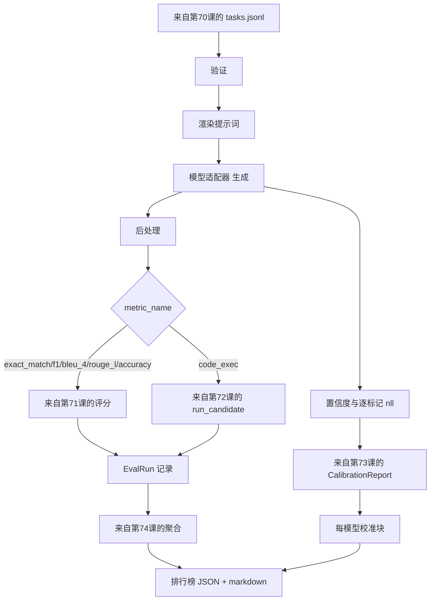

# End-to-End Eval Runner

> 五节管道课程，一节粘合它们。运行器从第70课读取任务规范，通过适配器调用模型，使用第71和第72课进行评分，附加来自第73课的校准报告，并输出第74课的排行榜。演示会自行终止。

**Type:** 构建  
**Languages:** Python  
**Prerequisites:** Phase 19 Track B 基础，第70至74课  
**Time:** ~90 分钟

## 学习目标

- 定义一个 `ModelAdapter` 接口，任何模型（mock、本地、API）都可以通过一个小的接口实现它。
- 使用 fixture JSONL 文件运行评估，并在 worker 池中对任务进行并行执行。
- 将度量层（exact_match、F1、BLEU-4、ROUGE-L、code_exec）与校准层在一次遍历中组合起来。
- 输出每个模型的 `EvalRun` 记录并直接送入排行榜聚合器。
- 输出 JSON 报告和 markdown 表格；在干净运行时以退出码 0 自行终止，在验证或运行时失败时以非 0 退出。

## 管道



运行器是集成点。第70到74课的每一课各自拥有一个模块，运行器将它们组合在一起。运行器不复制这些模块的任何逻辑：它们被导入使用。

## 适配器接口

适配器是运行器与任何模型之间的接缝。接口故意很小。

```python
class ModelAdapter:
    model_id: str

    def generate(self, prompt: str, task: TaskSpec) -> Generation: ...
```

`Generation` 是一个 dataclass，包含：

- `text`: 模型的自由格式输出
- `confidence`: 一个位于 `[0, 1]` 的浮点数，表示模型自报的答案概率
- `token_nll`: 可选，生成标记的负对数似然之和
- `token_count`: 可选，生成的标记数

运行器中的 mock 适配器提供三种风格：`RuleBasedAdapter`（确定性，接近完美）、`NoisyAdapter`（过度自信，常常错误）和 `BiasedAdapter`（对某一类表现良好，对另一类很差）。演示对第70课的 fixture 运行这三者。

## 并行执行

运行器使用 `concurrent.futures.ThreadPoolExecutor` 在每个模型上并行运行任务。worker 数量默认为 8 与任务数中较小者。线程已经足够，因为真实模型调用的瓶颈是网络 I/O。代码执行路径会在任务内产生自己的子进程，executor 仅调度等待操作。

对于确定性测试，运行器暴露 `run_eval(adapters, tasks, parallel=False)` 以便测试可以固定执行顺序。

## 单遍评分循环

对于每个任务：

1. 渲染提示词（少样本前缀加上提示主体）。
2. 调用适配器并计时。
3. 根据任务规则对生成结果进行后处理。
4. 分派到度量层。
5. 构建包含分数和度量元数据的 `EvalRun` 记录。
6. 将 `(confidence, correct)` 对附加到校准缓冲区。

对于 exact_match 风格的度量（`exact_match`, `accuracy`, `code_exec`），`correct` 信号为 `score >= 1.0`；对于分级度量，阈值为 `score >= 0.5`。阈值位于 `_correct_from_score`，运行器不公开覆盖接口。

## 聚合

在每个任务都有结果后，运行器调用第74课的 `aggregate` 和 `pairwise_diffs`，以及第73课的 `CalibrationReport.from_predictions`。输出是一个单一的 JSON 信封：

```json
{
  "leaderboard": [...],
  "pairwise": [...],
  "calibration": {
    "model_id_a": {"ece": 0.04, "brier": 0.10, "populated_bins": 8, ...},
    ...
  },
  "summary": {
    "tasks": 10,
    "models": 3,
    "wall_seconds": 1.2
  }
}
```

运行器还会将一个 markdown 表格写到 stdout，方便用户将结果粘贴到 PR 评审中。

## 自行终止的演示

演示在第70课的十个 fixture 任务上运行三个 mock 适配器。总耗时应低于十秒。干净运行时退出码为 0。

干净运行的判定条件：

- 每个任务都通过第70课的验证。
- 每个任务都通过第71和第72课的评分。
- 第73课的校准报告成功聚合且无错误。
- 排行榜中 rule-based 适配器严格高于 random 适配器。

如果任何一项失败，运行器将以非 0 退出，并在 JSON 信封中返回结构化错误。

## 本课不做的事情

它不调用真实模型。它不实现 API 密钥流程或速率限制处理。它不实现流式或部分生成；适配器每次调用返回一次生成。它不做重试或缓存。这些关切属于适配器层；运行器对度量和提供者保持中立。

## 如何阅读代码

`main.py` 是集成点。它通过一个小的 `_load_sibling` 帮助函数按相对路径解析并导入其他五个课程模块。本地定义了 dataclasses `Generation`、`EvalReport` 和 `ModelAdapter`。mock 适配器位于文件底部。

从上至下阅读 `main.py`。先浏览导入部分，然后查看 `run_eval`，接着 `_score_one`，最后看适配器。末尾的演示是入口点。

`code/tests/test_runner.py` 中的测试固定了适配器接口、单遍循环、并行与顺序等价性、校准缓冲区以及 JSON 信封的形状。

## 更进一步

这个运行器是地板版本。生产级评估系统会增加：以 `(task_id, model_id, model_version)` 为键的结果缓存、跟踪每次运行的花费和 token 的费用账本、在速率限制时退避的重试层、针对 pass-at-k 任务的采样策略以及适用于长套件的流式输出格式。上述每一项都是单一职责，可以在不修改度量或聚合层的情况下包装运行器。这种分离正是契约的目的。

在 mock 工作后，为真实提供者添加适配器。选择一个有免费额度的提供者，写三十行粘合代码，观察排行榜被点亮。然后再添加第二个提供者，让测试框架完成其余工作。