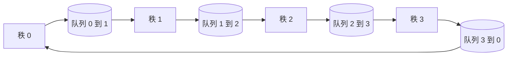

# 从零实现集合通信（Collective Ops From Scratch）

> 支撑分布式训练的四个集合通信操作是 allreduce、broadcast、allgather 和 reduce_scatter。每个训练框架提供的其它原语本质上都是围绕这些操作的封装。在 `multiprocessing.Queue` 网格上实现它们一次，基于参考实现验证，然后其余部分就是管道搭建。

**Type:** 构建  
**Languages:** Python  
**Prerequisites:** Phase 19 Track C 课程 42-49  
**Time:** ~90 分钟

## 学习目标

- 用两步法（reduce-scatter 然后 allgather）实现环形 allreduce，并证明每个 rank 的通信字节量为 2(N-1)/N 每元素。
- 在 `multiprocessing.Queue` 的点到点发送之上构建 broadcast、allgather 和 reduce_scatter。
- 将每个原语与使用相同输入和 world size 的 `torch.distributed` gloo 参考实现进行验证。
- 就集群形态、延迟下限和带宽上限为环形还是树形做出并捍卫选择。

## 问题背景

一个天真的 allreduce 在 N 个 rank 上会把张量发送到某个 root N 次，然后再广播回去 N 次。带宽按每个 rank O(N) 缩放，root 成为瓶颈，壁钟时间下界为最慢链路乘以 N。环形 allreduce 将其展平为 2(N-1) 个大小为 T/N 的块，因此每个 rank 的字节数降为 2T(N-1)/N，与集群规模无关。树形 allreduce 在小 N 和高延迟链路下占优，因为深度是 log2(N) 跳而不是 2(N-1)。为集群形态选错拓扑，最慢的 GPU 就决定步时间。

本轨你会阅读的每个分布式训练框架都依赖这四个原语。PyTorch DDP 用每个参数 bucket 一次 allreduce 来同步梯度。ZeRO 用 reduce_scatter 来分片优化器状态，并用 allgather 广播更新后的参数。FSDP 将完整前向变为 allgather 加 reduce_scatter。流水并行在阶段组间需要 broadcast 来传递激活。如果你不能实现这四个集合操作，你就无法推断训练为何停滞、为何在 rank 3 出现梯度不匹配，或为何在交换拓扑时流水气泡翻倍。

## 概念



### 两步法的环形 allreduce

将张量分为 N 个相等的块，索引为 0..N-1。每个 rank 拥有与其 rank 相等索引的块。第一步，reduce-scatter，运行 N-1 个步骤。在步骤 s，rank r 发送块 (r - s) mod N 到 rank (r + 1) mod N，并从 rank (r - 1) mod N 接收块 (r - s - 1) mod N，将接收到的块累加到本地副本中。经过 N-1 步后，rank r 拥有块 r 的完整和。第二步，allgather，运行另外 N-1 个步骤，将计算完的块在环中旋转，直到每个 rank 都持有每个块的完整和。

| Primitive | Per-rank bytes | Steps | When to use |
|-----------|---------------|-------|-------------|
| Ring allreduce | 2T(N-1)/N | 2(N-1) | 大 T，带宽充裕且集群同构 |
| Tree allreduce | T log2(N) | 2 log2(N) | 小 T 或 高延迟链路 |
| Broadcast | T | log2(N) 树 | 参数初始化、标量配置 |
| Allgather | T(N-1)/N | N-1 | 分片前向，ZeRO 反切换 |
| Reduce_scatter | T(N-1)/N | N-1 | ZeRO 梯度分片 |

### 用队列网格替代 NCCL

NCCL 在 PCIe 和 NVLink 上运行并提供硬件加速的规约。在 CPU 上没有这些。为环的每条边使用一个 `multiprocessing.Queue` 可以提供有序的点对点传递，且单生产者单消费者。规约在用户空间进行，所以你需要承担 Python 开销，但线型模式与 NCCL 的环形 allreduce 完全一致。在队列版本上证明正确性，集群行为便可类推。

### 与 gloo 验证

每个原语都会配有单元测试，将其输出与使用 gloo 后端初始化的 `torch.distributed` 在相同张量和 world size 下的输出比较。如果你的环形 allreduce 与 gloo 的差异超过 float32 的机器精度，测试应失败。基于参考实现的验证是不可妥协的；没有它，这个原语看起来可能正确，直到真实训练的第 10000 步出问题。

## 构建说明

`code/main.py` 实现了：

- `Mesh` 类：将 N 个 `multiprocessing.Queue` 实例按环接线，并为每个 rank 暴露 `send(dst, tensor)` 和 `recv(src)`。
- `ring_allreduce(mesh, rank, world_size, tensor)`：运行两步算法。
- `broadcast(mesh, rank, world_size, tensor, src)`：基于对数树实现。
- `allgather(mesh, rank, world_size, tensor)`：使用 N-1 次轮转实现。
- `reduce_scatter(mesh, rank, world_size, tensor)`：作为 allreduce 的前半部分。
- `_gloo_reference(op, world_size, tensor)`：使用相同输入通过 `torch.distributed` 的 gloo 后端运行以进行逐字节比较。

运行方式：

```bash
python3 code/main.py
```

输出：每个原语的验证表，比较队列网格实现与 gloo 的输出，随后给出每个 rank 的字节计数，证明 2T(N-1)/N 的缩放规律。

## 生产实践

三种实践使这些原语足够稳健以投入生产。

- 桶化梯度再 allreduce。一个 10 亿参数的模型有成千上万的梯度张量。对每个张量执行一次 allreduce 会使延迟下限被触发 N 次。DDP 将梯度打包成约 25 MB 的 bucket，并对每个 bucket 执行一次 allreduce；小张量随大张量一起发送。没有桶化时延迟开销占主导。
- 在通信上重叠计算。反向按层反向计算梯度。当最顶层梯度准备好时，立即启动该层的 allreduce，同时下一层继续计算。PyTorch DDP 用 bucket-ready 钩子来连线这一流程。当网络有空闲时，这种重叠能将可见通信时间减半。
- 按消息大小选择环或树，而不是信仰问题。NCCL 带有一个拓扑检测器，当消息大于约 1 MB 时选择 ring，低于则选择 tree。交叉点由带宽与延迟决定：在 1 MB 以上，带宽项 2T(N-1)/N 起主导作用，环占优；在 1 MB 以下，log2(N) 的跳数占优。硬编码单一拓扑会在错误的消息大小上损失吞吐量。

## 使用方式

生产模式：

- PyTorch DDP。后向后对已桶化的梯度调用 `dist.all_reduce`。桶大小可调；对 100Gbit 以太网来说默认 25 MB 是合理的。
- DeepSpeed ZeRO。调用 reduce_scatter 来分片梯度，并在前向前通过 allgather 重建完整参数。本课的原语正是 ZeRO 使用的那些。
- FSDP。前向先用 allgather 来反切片层，计算后再用 reduce_scatter 归约并丢弃反切片。原语相同，仅调度不同。

## 投产接入

在课程 77-81 中使用队列网格原语。第 77 课将 allreduce 接入 DDP。第 78 课将 reduce_scatter 接入 ZeRO。第 79 课将 broadcast 接入流水并行的激活。第 81 课将四个原语组合成端到端演示。

## 练习

1. 添加一个树形 allreduce 变体，并按消息大小在环和树之间切换。测量交叉点。
2. 添加一个 `recv_timeout_ms`，使卡住的 rank 在超时后显示截止错误而不是永远挂起。
3. 将 `multiprocessing.Queue` 替换为 TCP 套接字以实现四个原语。保持相同的测试，更真实的网络线。
4. 添加带宽监测钩子，使每个 rank 的字节计数记录为 JSONL。
5. 比较在 4 个 rank 上，张量大小为 1KB、1MB、16MB 时环与树的壁钟时间。用经验数据为交叉点辩护。

## 关键术语

| Term | 人们如何说 | 实际含义 |
|------|-----------|---------|
| Allreduce | "在 ranks 之间求和" | 调用结束后每个 rank 都持有相同的规约后张量 |
| Ring | "最快的拓扑" | N-1 个大小为 T/N 的块在环上流动两次 |
| Tree | "对数拓扑" | 规约沿二叉树进行；深度为 log2(N) 跳 |
| Allgather | "拼接分片" | 每个 rank 最终拥有所有其他 rank 的分片 |
| Reduce_scatter | "拆分求和" | 每个 rank 最终只保留某个块的和 |
| Bucket | "融合小张量" | 将 N 次小的 allreduce 合并为一次大的 allreduce |

（注：术语翻译遵循常见分布式训练领域用法；Primitives 名称如 allreduce、reduce_scatter 等在文中保留原名以便对应实现与 API。）

## 进一步阅读

- [PyTorch Distributed: NCCL collectives](https://pytorch.org/docs/stable/distributed.html#collective-functions)
- [Horovod ring allreduce paper](https://arxiv.org/abs/1802.05799)
- [NCCL topology and algorithm selection](https://docs.nvidia.com/deeplearning/nccl/user-guide/docs/index.html)
- [Patarasuk and Yuan, Bandwidth optimal allreduce algorithms](https://www.cs.fsu.edu/~xyuan/paper/09jpdc.pdf)
- Phase 10 Lesson 05 - distributed training overview
- Phase 19 Lesson 77 - DDP wired on top of these primitives