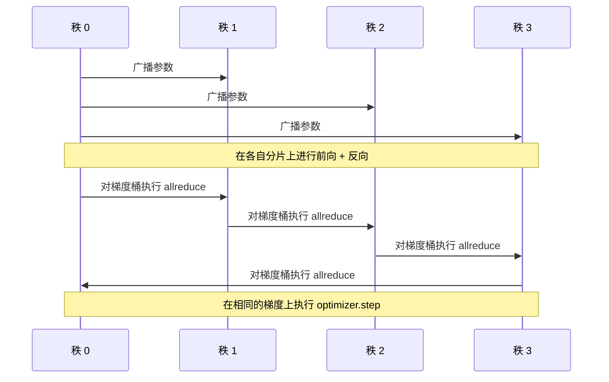

# Data Parallel DDP From Scratch

> DistributedDataParallel is a hook on top of allreduce. Wrap a model, broadcast the initial parameters from rank 0 so every rank starts identical, install a backward hook on every parameter that issues an allreduce of the gradient, and the rest is gradient descent. The whole pattern is 200 lines.

**Type:** 构建
**Languages:** Python
**Prerequisites:** Phase 19 Track C 课程 42-49
**Time:** ~90 分钟

## 学习目标

- 实现一个形状类似 `DistributedDataParallel` 的包装器：在构造时广播初始参数，并在反向之后对梯度执行 allreduce。
- 使用基于文件的 rendezvous，在 gloo backend 上通过 `torch.multiprocessing.spawn` 启动 N 个 CPU rank。
- 通过在相同数据上以串行方式训练相同模型并显示每步参数等价性，证明梯度同步的正确性。
- 论证桶（梯度融合）和重叠（在反向期间的通信重叠）是将一个可工作的 DDP 变成可生产化 DDP 的两项关键改动。

## 问题背景

一个拥有 10 亿参数且激活占用 12 GB 的模型无法放入一块消费级 GPU。即便能放下，训练也要花数周。数据并行将一个 batch 在 N 个 rank 间拆分，每个 rank 在其分片上计算前向和反向，在每个步骤结束时将所有 rank 的梯度求和，以便 N 个副本保持一致。优化器在求和后的梯度上进行更新。

如果没有梯度同步，N 个副本在第二步就会出现发散。模型不再是“在更多数据上训练的一个模型”，而是 N 个仅共享初始权重的独立模型。若梯度同步做得不好（每个参数一次 allreduce、没有重叠、没有分桶），网络成为瓶颈，GPU 会因等待网络而空闲。DDP 的工艺是把梯度同步的开销降低到相对于计算几乎可以忽略的水平。PyTorch 的标准 DDP 通过梯度分桶、将 allreduce 与下一层反向计算重叠，以及在 NVLink 上使用 NCCL 来做到这一点。我们也可以在 CPU 上用 gloo 做到相同的三点并从中学习。

## 概念



### DDP 需要的三类操作

| Stage | Collective | Why |
|-------|-----------|-----|
| Init | broadcast from rank 0 | Every rank starts with the same parameters |
| After backward | allreduce of each grad | The mean gradient is what the optimiser steps on |
| Sometimes | broadcast of buffers | Batchnorm running stats stay synchronised |

### 为什么要取均值而不是求和

Allreduce-SUM 再除以 world_size 得到均值梯度。均值相对于 world_size 是不变的：在一个 rank 上调好的学习率在四个 rank 上也能工作，因为每步的梯度幅度不会改变。若只使用 SUM 而不除以 world_size，则每次改变集群规模都必须重新调整学习率。DDP 将 SUM 包装并除以 world_size；在本课中也应如此实现。

### 为什么要把梯度分桶

一个 transformer 有成千上万个参数张量。对每个张量做一次 allreduce 会把 gloo 的延迟基线支付成千上万次。DDP 把梯度按大约 25MB 的桶分组，并对每个桶做一次 allreduce。传输的总字节数不变，但延迟被摊薄到桶中。对于本课的微小模型我们把所有东西归为一个桶；关键的结构在于思路可扩展。

### 为什么要固定随机种子

每个 rank 必须用 `torch.manual_seed(seed + rank)` 来进行数据打乱，但参数初始化要用 `torch.manual_seed(seed)`。共享相同的种子会导致每个 rank 看到相同的 batch 顺序（这会破坏数据并行）；而为参数使用与 rank 相关的种子会导致初始参数在浮点精度上有所差别，梯度同步随后也无法使副本精确相等。保证种子使用方式正确，否则参数等价性的测试在第一步就会失败。

## 实现

`code/main.py` 实现了：

- `MiniMLP`：一个 3 层 MLP，足够小以在数秒内收敛，但足够大以暴露分布式接线问题。
- `DistributedDataParallel(model, world_size)`：在构造时广播参数，返回一个包装器，其 `sync_grads` 会把 allreduce 求和后的梯度除以 world_size。
- `worker(rank, world_size, ...)`：使用 gloo 的 `torch.distributed` 初始化的完整训练循环，包含前向、反向、同步、更新。
- `_reference_single_process_loop(...)`：在单个进程上对相同数据进行串行训练，用于测试每步参数逐字节相等性。

运行：

```bash
python3 code/main.py
```

输出：一个每步的训练表格，比较单进程的 loss 与参数校验和与在 4 个 ranks 上运行的 DDP。两条路径在浮点精度范围内产生相同的 loss 曲线，从而证明梯度同步是正确的。

## 生产环境中的模式

三种模式让 DDP 足够健壮以投入生产。

**找出未被使用的参数。** 有些前向路径会有条件地跳过参数（早停、专家混合路由）。被跳过的参数没有梯度，但 DDP 的准备分桶钩子仍会等待它们，导致 allreduce 死锁。`find_unused_parameters=True` 告诉 DDP 在 reduce 前检查哪些参数收到了梯度。代价是每步要做一次图遍历，所以除非前向有分支，否则不要开启。

**静态图优化。** 当前向在各步间稳定时，`static_graph=True` 允许 DDP 预先计算分桶计划。该优化在大规模时很重要：预计算每步能节省几毫秒，累积在 10000 步上很显著。

**梯度累积需要小心。** 在不在每个微批次后同步的情况下对 K 个微批次进行累积可带来大约 10 倍的吞吐率提升。DDP 提供 `no_sync()` 上下文管理器来暂停反向后的 allreduce。如果忘记使用该上下文管理器，你会对 K 个微批次都做 allreduce，吞吐率会降到网络瓶颈水平。

## 使用它

生产实践：

- **PyTorch DDP。** 规范实现。`torch.nn.parallel.DistributedDataParallel(model)` 把分桶、重叠和 no_sync 上下文都接起来。
- **HuggingFace Accelerate。** 提供 launcher 来处理 `torchrun` 的环境变量并在模型上做封装。底层仍然是相同的 DDP。
- **Megatron-LM 数据并行。** 将 DDP 与张量并行结合以应对超大模型；其中的数据并行部分仍然是反向后 allreduce 的模式。

## 上线之后

Lesson 78（ZeRO sharding）用 reduce_scatter 替换了逐参数的 allreduce，这样每个 rank 只存自己的优化器状态切片。Lesson 81 将 DDP 与 ZeRO 组合成端到端演示。

## 练习

1. 添加可配置大小的梯度桶，并在更深的模型上测量相较于每参数一次 allreduce 的加速比。
2. 实现 `no_sync()` 作为上下文管理器，并验证在 K 个微批次上的梯度累积与单进程基线相匹配。
3. 增加一个 `find_unused_parameters` 模式，其中前向有时会跳过 MLP 的某一层；在不启用该标志的情况下运行应当死锁。
4. 用仅基于 `torch.distributed.barrier()` 的同步替换 gloo 的 allreduce，感受基于 allreduce 的同步与基于 barrier 的同步的差异。
5. 测量在 batch size 为 1、16、256 时梯度同步开销占每步时间的比例，并解释其伸缩特性。

## 术语表

| Term | What people say | What it actually means |
|------|----------------|------------------------|
| DDP | "Data parallel" | Wrapper that broadcasts params and allreduces grads each step |
| Bucket | "Fuse grads" | Group N small allreduces into one large one |
| Overlap | "Hide comm" | Issue allreduce while later layers still computing backward |
| no_sync | "Accumulate" | Skip the post-backward allreduce for gradient accumulation |
| find_unused | "Branchy forward" | Detect parameters with no grad before reducing |

## 延伸阅读

- [PyTorch DistributedDataParallel docs](https://pytorch.org/docs/stable/generated/torch.nn.parallel.DistributedDataParallel.html)
- [PyTorch DDP internals tutorial](https://pytorch.org/tutorials/intermediate/ddp_tutorial.html)
- [Li et al, PyTorch Distributed: Experiences on Accelerating Data Parallel Training](https://arxiv.org/abs/2006.15704)
- Phase 19 Lesson 76 - the collectives DDP is built on
- Phase 19 Lesson 78 - ZeRO sharding replaces the per-param allreduce with reduce_scatter