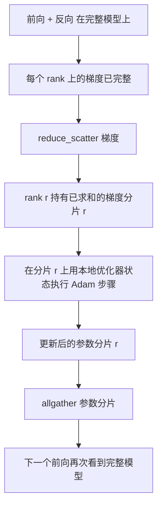

# ZeRO 优化器状态分片

> Adam 为每个参数保存两个矩估计（moment），均为 float32。一个 7B 参数模型携带 56 GB 的优化器状态。ZeRO stage 1 将其在 N 个 rank 上分片；每个 rank 拥有 1/N 的优化器状态。局部 step 完成后，更新的参数分片被广播回去，每个 rank 重建完整模型，然后开始下一步。带来的收益是训练栈中最大单次分配的线性内存下降。

**Type:** 构建  
**Languages:** Python  
**Prerequisites:** Phase 19 Track C lessons 42-49  
**Time:** ~90 分钟

## 学习目标

- 在 N 个 rank 上对优化器状态（第一矩、第二矩、fp32 主副本）进行分片，使得每个 rank 拥有 1/N。  
- 使用 reduce_scatter 仅将每个 rank 所需的分片梯度和传递给它，然后使用 allgather 将更新后的参数分片广播回去。  
- 为 stage 1、stage 2、stage 3 与原生 DDP 计算内存节省表。  
- 基于模型大小和带宽预算，为选择 stage 1 / stage 2 / stage 3 提出防守理由。

## 问题描述

原生 DDP 会完全复制一切：参数、梯度和优化器状态在每个 rank 上都是完整存在的。对于一个 7B 参数的 fp16 模型，这意味着每个 rank 有 14 GB 的参数、14 GB 的梯度和 28 GB 的优化器状态。优化器状态是最大的一项，并且最容易分片，因为它仅在 step 时被访问，而不是在前向或反向期间。

ZeRO stage 1 对优化器状态进行分片。每个 rank 保存 Adam 矩的一部分（1/N）。在反向之后，与其对完整梯度做 allreduce 并在本地 step，不如使用 reduce_scatter，使每个 rank 只接收它的分片的求和梯度。该 rank 将优化器步骤应用于它所拥有的 fp32 主副本分片。然后更新后的参数分片 allgather 回来，使每个 rank 在下一个前向时再次拥有完整模型。优化器内存按 N 缩减。每步的网络传输与 DDP 相同：一个 reduce_scatter 加一个 allgather 在带宽上等同于一个 allreduce。内存获益，吞吐量不变。

## 概念



### ZeRO 的各个阶段

| Stage | 分片对象 | 每个 rank 的内存 | 每步通信 |
|-------|----------|------------------|----------|
| DDP | 无 | params + grads + optim | 1x allreduce |
| ZeRO-1 | 优化器状态 | params + grads + optim/N | 1x reduce_scatter + 1x allgather |
| ZeRO-2 | optim + grads | params + grads/N + optim/N | 1x reduce_scatter + 1x allgather |
| ZeRO-3 | optim + grads + params | params/N + grads/N + optim/N | 每层 1x allgather + 每层 1x reduce_scatter |

Stage 1 是最容易得到的收益，因为优化器状态在预算中占主导。Stage 2 需要梯度分片累积逻辑，但带宽相同。Stage 3（即 FSDP）在每次前向和反向上按层支付通信开销，从而获得参数分片的内存下降。本课实现了完整的 stage 1。

### 内存计算，实际数值

对于一个有 P 个参数并在混合精度下用 Adam 训练的模型：

| 项目 | Vanilla | ZeRO-1 | 原因 |
|------|---------|--------|------|
| fp16 参数 | 2P 字节 | 2P 字节 | 前向需要 |
| fp16 梯度 | 2P 字节 | 2P 字节 | 反向需要 |
| fp32 主副本 | 4P 字节 | 4P/N 字节 | 仅优化器使用 |
| fp32 一阶矩 | 4P 字节 | 4P/N 字节 | 仅优化器使用 |
| fp32 二阶矩 | 4P 字节 | 4P/N 字节 | 仅优化器使用 |
| 总计 | 16P 字节 | 4P + 12P/N 字节 |  |

当 N=8 时：vanilla 为 16P，ZeRO-1 为 5.5P，下降 65%。当 N=64 时：vanilla 为 16P，ZeRO-1 为 4.19P，下降 74%。

### 为什么 reduce_scatter 比 allreduce-then-shard 更好

Allreduce 会把完整的求和梯度给到每个 rank。如果你只需要分片 r，那么在 rank r 上被传输的 (N-1)/N 的梯度就是浪费。Reduce_scatter 精确地把每个 rank 所需的分片传送给它；每个 rank 的字节传输与 allreduce 相同（因为 allreduce = reduce_scatter + allgather），但第二部分被后面的参数分片 allgather 所取代。总体线上传输与 DDP 相同，内存被划分。

## 构建实现

`code/main.py` 实现了：

- `flatten_params(module)` 和 `unflatten_into(module, flat)`，用于将模型参数打包到一个连续的张量中并解包回去。平铺（flat）布局使得按 rank 分片成为简单的切片操作。  
- `ZeroOptimizer(model, world_size, rank, lr)`，它拥有该 rank 的 fp32 主副本和 Adam 矩分片。  
- `step()`，对平铺的梯度运行 reduce_scatter，将 Adam 应用于 rank 的分片，并 allgather 更新后的参数回去。  
- 一个示例演示，训练一个 3 层 MLP 共 20 步，并打印每步的内存预算及与原生 DDP 基线的对比。

运行：

```bash
python3 code/main.py
```

输出：每步的损失以及内存表，显示 ZeRO-1 在每个 rank 上只保存 1/N 的优化器状态，而 DDP 则保存完整副本。

## 生产中的模式

三种模式使 ZeRO 足够健壮以用于生产。

**分片化检查点很重要。** ZeRO-1 的优化器状态在 rank 之间被分片；检查点必须记录哪个 rank 拥有哪些分片。Lesson 80 构建了用于恢复 ZeRO 运行（在相同 world size 下）的分片检查点清单。没有该清单，保存的状态在重启时是不可读的。

**混合精度是关键。** ZeRO 是一种混合精度技术；被分片的是 fp32 主副本。若在不使用混合精度的情况下运行 ZeRO，则需要为 fp32 主副本支付内存开销，却得不到 fp16 前向带来的收益。生产环境通常会将 ZeRO 与 autocast 或 bf16 权重配合使用。

**Stage 1 是几乎免费且有效的收益。** 在带宽上与 DDP 相同。内存节省与 N 呈线性关系。唯一的成本是对优化器分片的记录管理。生产栈默认采用 stage 1，除非参数分片的内存也成为问题；这时 stage 2 或 3 会以通信换内存。

## 使用方式

生产级实现包括：

- **DeepSpeed ZeRO。** 参考实现。`deepspeed_config.json` 选择 stage 1/2/3 和分区大小。  
- **PyTorch FSDP。** PyTorch 原生等价项。`ShardingStrategy.SHARD_GRAD_OP` 对应 ZeRO-2；`FULL_SHARD` 对应 ZeRO-3。  
- **HuggingFace Accelerate。** 在统一配置下封装了 DeepSpeed 和 FSDP。

## 部署场景

Lesson 79（流水线并行）是正交的分片轴：它不是在同一个模型上分片优化器状态，而是把层在 rank 之间进行流水线分片。Lesson 81 将 DDP + ZeRO 在端到端示例中进行组合。

## 练习

1. 扩展到 ZeRO-2，通过分片梯度：每个 rank 仅保存其分片的梯度，在反向后将非分片部分置零以实现。  
2. 添加一个内存分析器，在 rank 0 上打印实际的 fp32 字节使用与公式预测值的对比。  
3. 测量原生 DDP 与 ZeRO-1 的每步墙钟时间，并分解为前向、反向、通信时间。  
4. 在 ZeRO-1 下实现梯度裁剪（gradient clipping）：L2 范数必须通过对局部范数平方做 allreduce 来跨分片计算。  
5. 实现一个“天真的 ZeRO”，使用 allreduce 而不是 reduce_scatter，测量线上的时间差异。用数据为 reduce_scatter 的选择做辩护。

## 关键词

| 术语 | 常说的话 | 实际意义 |
|------|----------|---------|
| ZeRO-1 | "Shard the optimiser" | 每个 rank 持有 1/N 的 fp32 主副本 + Adam 矩 |
| ZeRO-2 | "Shard grads too" | 每个 rank 在 reduce_scatter 后也丢弃非分片的梯度 |
| ZeRO-3 | "Shard params" | 每个 rank 持有 1/N 的 fp16 参数；前向按层 allgather |
| Master copy | "fp32 weights" | 优化器更新用的高精度参数副本 |
| Reduce_scatter | "Split the sum" | 仅把每个 rank 所需的分片求和梯度传给它 |

## 延伸阅读

- [Rajbhandari et al, ZeRO: Memory Optimizations Toward Training Trillion Parameter Models](https://arxiv.org/abs/1910.02054)  
- [DeepSpeed ZeRO documentation](https://www.deepspeed.ai/tutorials/zero/)  
- [PyTorch FSDP documentation](https://pytorch.org/docs/stable/fsdp.html)  
- Phase 19 Lesson 76 - 本课所依赖的 reduce_scatter 与 allgather  
- Phase 19 Lesson 80 - 必须用于 ZeRO 状态的分片化检查点