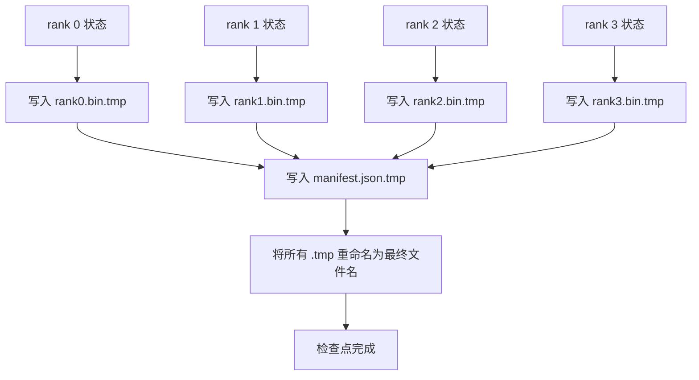

# 分片检查点与原子恢复

> 一个 700 亿参数的训练作业每隔几小时就会因为节点故障而暂停一次。检查点格式决定你是损失 30 分钟还是 30 小时。分片检查点并行写出每个 rank 的分片并在 manifest 中记录归属。恢复时从每个 rank 自己的文件加载其分片，在相同的 world size 下重建状态，优化器如同什么都没发生一样继续。原子写入避免半途而废的检查点在下次恢复时污染状态。

**Type:** 构建  
**Languages:** Python  
**Prerequisites:** Phase 19 Track C 课程 42-49  
**Time:** ~90 分钟

## 学习目标

- 将多 rank 的检查点保存为每个 rank 的分片文件加上记录哪个 rank 拥有什么的 manifest。
- 使用原子写入模式（先写入临时路径然后重命名），以便写入过程中崩溃不会产生半成品检查点。
- 从 manifest 恢复时，验证每个 rank 上 fp16 参数和 ZeRO 优化器状态的字节等价性。
- 针对三种失败模式加固 manifest 模式：world-size 变更、分片数量不匹配和部分写入。

## 问题陈述

一个原始的检查点实现会将所有参数和优化器状态读入 rank 0，聚合并写入单个文件。对于 700 亿参数的模型，这意味着通过单个 rank 的网络端口传输 1.1 TB 的状态。写入会阻塞其他所有 rank，因为它们在等待聚合。IO 带宽受限于最慢的单个 GPU 的网络链路，而不是聚合带宽。在真实集群上，聚合然后写入这一步可能比之前的训练小时还要久，这意味着每天保存的检查点少于一个。

分片检查点翻转了这个模式：每个 rank 并行将自己的分片写到自己的文件。manifest 记录哪个 rank 拥有哪个分片，以便恢复时将每个分片放回其来源位置。聚合写入带宽随集群扩展。一个通过单个 rank 需要 4 小时写完的 1 TB 检查点，通过 64 个 rank 并行写只需 4 分钟。此外，manifest 为不兼容的恢复提供了契约：world-size 变化可检测，部分写入可检测，加载路径可以显式失败而不是静默使用陈旧数据。

## 概念



### Manifest schema

```json
{
  "world_size": 4,
  "step": 1234,
  "wall_clock_seconds": 4521,
  "shards": [
    {"rank": 0, "path": "rank0.bin", "sha256": "...", "param_shard_offset": 0, "param_shard_numel": 65536},
    {"rank": 1, "path": "rank1.bin", "sha256": "...", "param_shard_offset": 65536, "param_shard_numel": 65536}
  ],
  "schema_version": 1
}
```

三个字段是承重字段。`world_size` 使得在不同大小上恢复时显式失败而不是静默损坏。每个分片的 `sha256` 捕获部分或损坏的写入。每个分片的 `param_shard_offset` 和 `param_shard_numel` 允许加载器在正确的位置上重建扁平参数张量。

### 原子写入

标准模式：将每个分片写到 `<name>.tmp`，将 manifest 写到 `manifest.json.tmp`，对每个文件执行 fsync，然后重命名。POSIX 在同一文件系统内的 rename 是原子的；要么新文件完全存在，要么旧文件仍在。最终 rename 之前的崩溃会让先前的检查点保持为活动状态。若没有原子写入，崩溃可能留下一个部分分片并且 manifest 指向它，加载时会污染优化器状态。

### 模式需防护的三种失败模式

| 失败类型 | 症状 | 防护措施 |
|---------|---------|---------|
| World-size 变化 | 在 N=8 上恢复但 manifest 来自 N=4 | manifest 中的 world_size 不匹配，显式失败 |
| 分片数量不匹配 | 恢复时发现比 manifest 指定的 shards 数量更少的 rank*.bin 文件 | 列举分片，验证每一个存在 |
| 部分写入 | 分片文件在 flush 过程中被截断 | 加载时校验 sha256 |

每个防护都会尽早拒绝错误加载；否则是静默损坏，可能在 100 步后才以 loss 变为 NaN 的形式显现。

### 为什么使用按 rank 文件，而不是一个大文件

通过 `O_APPEND` 并发写入一个文件在 POSIX 上对字节对齐的写入有效，但在实践中单个分片内的偏移跨越 MB 级区域，锁竞争占主导。按 rank 的文件没有争用，并且在底层文件系统为并行（如 Lustre、GPFS）时受益于条带化。生产栈（DeepSpeed、FSDP、NeMo）都出于这个原因使用按 rank 的文件。

## 构建它

`code/main.py` 实现了：

- `ShardManifest` dataclass，具有上面 schema 并附带 `to_json`/`from_json`。
- `save_sharded(state_dict_per_rank, dir, step)`：使用原子临时-然后-重命名模式，将每个 rank 的二进制状态写入自己的文件，然后写 manifest。
- `load_sharded(dir, expected_world_size)`：读取 manifest，验证每个分片的 sha256，并返回每个 rank 的 state dict。
- 一个往返测试：构建每个 rank 的状态，保存，加载，断言字节等价。

运行它：

```bash
python3 code/main.py
```

输出：写出 4 个分片文件加 manifest，然后重新加载并做字节等价验证。

## 生产中常见的模式

三种模式将检查点加固到可投入生产的水平。

**异步写入。** 生产栈通常在单独的线程或进程上发起检查点写入以便训练继续。障碍是下一次检查点：在前一次完成之前不要开始下一次保存。DeepSpeed 的 `async_io` 标志正是这样做的。本课保留同步写入以便步骤可见。

**先写本地快速磁盘，然后异步上传。** 先写入本地 NVMe（快速），然后异步上传到 S3 或 GCS。两层模式在群内保持快速恢复，同时将持久副本发到群外归档。manifest 记录本地路径；上传 manifest 记录远端路径。

**轮换很重要。** 生产运行通常保留最近 K 个检查点（通常 3-5）并轮换最旧的。若不轮换磁盘会在运行中被填满，下一次检查点会失败。有轮换时，下一次保存会先删除最旧的，释放空间预算。

## 使用示例

生产模式：

- **DeepSpeed checkpointing。** `deepspeed.save_checkpoint(tag=step)` 写出按 rank 的文件和一个指向活动 tag 的 `latest` 文件。
- **PyTorch FSDP checkpointing。** `torch.distributed.checkpoint` 使用一个决定每个 rank 布局的 `Planner` 保存分片状态。
- **NeMo。** 用统一的 `save_to_checkpoint` API 封装 DeepSpeed 和 FSDP，并添加元数据。

## 部署

第 81 课保存了端到端 DDP+ZeRO 运行的分片检查点，并在相同 world size 下重新加载以证明恢复契约成立。

## 练习

1. 添加异步写入：在一个线程中启动保存并让训练继续。阻塞下一次保存直到前一次完成。
2. 添加 `last_5_steps` 轮换：保留最近 5 个检查点，保存新检查点前删除最旧的。
3. 为内部循环重加载添加仅 CRC 的快速校验路径（轮换把一个检查点变为新的激活检查点时无需全量 sha256）。
4. 添加跨 world-size 的加载：从 N=4 到 N=8 的分片重平衡，方法是读取 manifest，拼接，然后重新分片。
5. 添加上传到伪 S3（第二个目录）并写上传 manifest。保护两级存储策略。

## 关键术语

| 术语 | 常说法 | 实际含义 |
|------|----------------|------------------------|
| Sharded checkpoint | “按 rank 保存” | 每个 rank 并行写出自己的分片文件 |
| Manifest | “索引” | 记录分片路径、偏移和 sha256 的 JSON 文件 |
| Atomic write | “先写 tmp 再重命名” | 写入 .tmp 然后 POSIX 重命名，这样崩溃会保留先前的活动文件 |
| Partial write | “分片被截断” | 写入过程中的崩溃产生损坏分片；sha256 可检测 |
| Rotation | “保留最近 K 个” | 在写新检查点前删除最旧检查点以限制磁盘使用 |

## 延伸阅读

- [DeepSpeed checkpointing](https://www.deepspeed.ai/tutorials/checkpointing/)（DeepSpeed 检查点）
- [PyTorch torch.distributed.checkpoint](https://pytorch.org/docs/stable/distributed.checkpoint.html)（PyTorch 分布式检查点）
- [POSIX rename atomicity](https://pubs.opengroup.org/onlinepubs/9699919799/functions/rename.html)（POSIX 重命名的原子性）
- Phase 19 Lesson 78 - 本检查点旨在保存的 ZeRO 状态
- Phase 19 Lesson 81 - 端到端示例验证已保存状态的往返转换