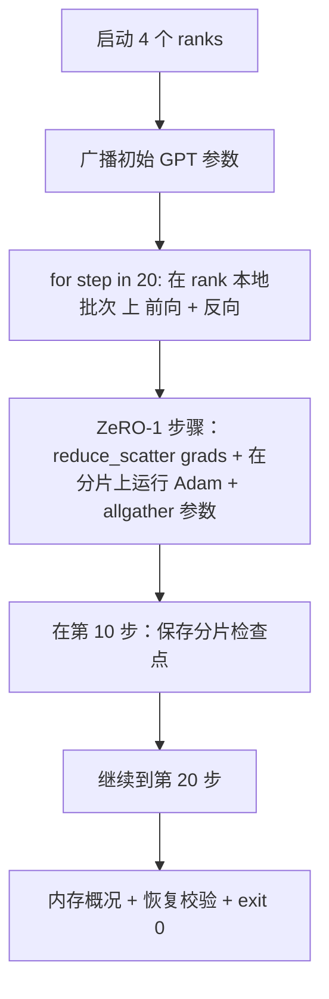

# 端到端分布式训练

> 课程 76 到 80 各自实现了一块功能。这是组装：一个在 4 个模拟 rank 上训练的小型 GPT，使用 DDP 进行梯度同步，ZeRO-1 做优化器状态分片，并在中途保存一个分片检查点。演示跑 20 步，自行终止，打印损失曲线和内存概况，并写入可恢复的检查点。

**Type:** 构建  
**Languages:** Python  
**Prerequisites:** Phase 19 Track C 第 42-49 课  
**Time:** ~90 分钟

## 学习目标

- 将 DDP（lesson 77）与 ZeRO-1（lesson 78）与分片检查点（lesson 80）组合到一个训练循环中。
- 在 4 个模拟 rank 上对一个小型合成语料训练一个 2 层 transformer 语言模型，训练 20 步。
- 打印每步损失表，每个 rank 的内存概况，以及一个在相同 world size 下可逐字节相等恢复的检查点清单。
- 为组合提供防御性证明：每个部分在早期课程中可独立测试，本课证明它们可以组合在一起。

## 问题描述

一次收官性的演示需要证明各个模块能组合在一起。课程 76 实现了 collectives。课程 77 将它们封装为 DDP。课程 78 使用 reduce_scatter 分片优化器状态。课程 79 分析了流水线。课程 80 保存了分片检查点。每节课都有自己的单元测试。一次真实训练运行同时使用所有原语；如果组合错误，损失会发散、检查点无法恢复，或者本应减少的每-rank 内存反而增长。

本课运行端到端演示并验证四个不变量： (a) 在 20 步内损失单调下降（浮点噪声范围内），(b) 每个 rank 在每步持有相同的参数范数，(c) 每-rank 的优化器内存等于 ZeRO-1 公式 12P/N 字节，(d) 在第 10 步保存的检查点在重启时逐字节相等地恢复。演示自我终止：20 步、单个命令、退出码 0。

## 概念



### 迷你 GPT

模型刻意很小：2 层 transformer block，嵌入维度 32，4 个 attention heads，词表大小 64，序列长度 16，batch 大小 4。参数量只有几千。足够覆盖所有连线决策（多头注意力运行标准的 mask 路径；LayerNorm 有权重需要同步；LM head 是一个单独的线性投影回到词表）。又足够小，以便在 4 个 CPU rank 上 20 步能在几秒内完成。

### 组合规则

| Lesson piece | 所负责的内容 | 留给训练循环的内容 |
|--------------|--------------|--------------------|
| DDP broadcast | 初始参数同步 | 在构造时调用一次 |
| ZeRO-1 step | 梯度同步、主副本更新、参数广播 | 每步一次的调用，替代 optimizer.step |
| Sharded checkpoint | 持久化每-rank 状态，带 sha256 的清单 | 在 rank 0 上调用，状态通过 allgather 收集 |
| Training loop | 前向、反向、损失记录 | 顺序调用以上三个模块 |

训练循环不关心 reduce_scatter 或 rendezvous 文件。ZeRO 和检查点模块暴露窄接口由循环进行组合。

### 为什么用一个小型 GPT 而不是 MLP

课程 77 的 MLP 足以验证梯度同步。一个小型 GPT 增加了三项内容：一个独立的 LM head（本课为清晰起见不绑定 embedding；完整 GPT 通常会把 head 与 token embedding 绑定），softmax+交叉熵作为损失（比 MSE 有更多数值边界情况），以及一个非对称的前向路径（先嵌入，然后注意力，然后每层的 MLP）。如果收官只用 MLP，会隐藏组合是否正确处理 LayerNorm 或嵌入层的梯度形状。

### 自我终止意味着退出码 0

循环运行固定的 20 步并退出。没有 `while True`，没有人工干预，也不从外部状态恢复。一个可以无人看管运行并在完成时得到完整日志的收官演示，才能证明系统连接正确。如果任一部分死锁，演示永远不会返回，测试机制会捕获这一点。

## 构建它

`code/main.py` 实现了：

- `MiniGPT`: 2 层 transformer，带掩码自注意力和一个独立的 LM head。
- `make_corpus(seed, total_tokens)`: 确定性下一 token 预测数据。
- `_train_worker`: 每个 rank 启动的子进程；广播初始参数，运行循环，调用 ZeRO 步，并在第 10 步写入分片检查点。
- `verify_resume`: 在主运行后，进程内重新加载第 10 步的检查点并断言保存的主分片与内存快照逐字节相同。
- `main`: 协调整个演示，打印损失表、内存概况和校验结果。

运行：

```bash
python3 code/main.py
```

输出：20 行的损失表，4 行的每-rank 内存概况，一个检查点清单，以及成功时的一行 "RESUME VERIFIED"。

## 生产环境中的模式

三个模式把组合用于真实运行。

**每隔 K 分钟检查点，而不是每隔 K 步。** 步耗随着序列长度和微批次数变化。按 10 分钟的检查点节拍能捕获相同的计算量，不受模型大小影响。本课为简单起见使用基于步数的检查点；生产环境使用基于墙钟时间的策略。

**尽早检测发散。** 生产中在反向后添加 NaN 护栏和损失跳变检测器；如果损失在一步内跃升超过 2 倍，就回滚到前一个检查点，而不是让优化器继续进入退化状态。本课的损失曲线平滑，因此护栏未被触发，但该钩子仍然保留。

**汇总跨 rank 的内存概况。** 真实运行中不同 rank 的内存不同（处于最大流水线阶段的 rank 保存更多激活）。生产记录跨 rank 的最大值和平均值；本课打印每-rank，以展示公式匹配。

## 使用场景

生产化模式：

- **DeepSpeed。** 在一个配置下组合 DDP + ZeRO + 流水线 + 激活检查点。课程中的组合实际上是 DeepSpeed 形态的微缩版本。
- **PyTorch FSDP。** 原生等价。`FullyShardedDataParallel` 配合 `ShardingStrategy.SHARD_GRAD_OP` 对应 ZeRO-2。
- **NeMo 和 Megatron-LM。** 对于非常大的模型会加上 Tensor Parallel；否则组合形态相同。

## 交付

整个学习路径到此结束。这 6 节课构成了真实团队在采用 DeepSpeed 前需要构建的分布式训练子系统；该抽象已在 gloo 上得到验证，失败模式已被演练。Phase 17（基础设施与生产）是将这套组合带到真实集群的归宿。

## 练习

1. 添加 attention head 的张量并行切分并验证损失与单 rank 基线匹配。两个 rank：每个 rank 负责一半的 heads，attention 输出做 allreduce。
2. 添加跨 4 个微批次的梯度累积并证明累积梯度等于一个大 batch 的梯度。
3. 添加一个从第 10 步恢复继续训练到第 20 步的路径，并产生与原运行相同的最终损失。
4. 添加一个指标导出（loss、grad norm、step time）到 JSONL，以便事后可视化运行数据。
5. 添加一个 NaN 护栏，在损失跳变时回滚到前一个检查点，并通过一步学习率倍增强制触发一次跳变以演练回滚流程。

## 术语关键词

| 术语 | 人们怎么说 | 实际含义 |
|------|-----------|---------|
| End-to-end | “把所有东西接起来” | 一次运行组合所有模块，而不是每块的单元测试 |
| Memory profile | “每个 rank 的 GB 数” | 每个 rank 为参数、梯度、优化器状态占用的字节数 |
| Resume contract | “保存与加载” | 检查点往返后每-rank 状态逐字节相等 |
| Self-terminating | “有界运行” | 固定步数，完成时退出码 0，无需人工干预 |

## 延伸阅读

- [DeepSpeed end-to-end training tutorial](https://www.deepspeed.ai/getting-started/)
- [PyTorch FSDP advanced tutorial](https://pytorch.org/tutorials/intermediate/FSDP_advanced_tutorial.html)
- [Megatron-LM training script reference](https://github.com/NVIDIA/Megatron-LM)
- Phase 19 Lessons 76-80 - 本课组合的每个部分
- Phase 17 - 将组合迁移到真实集群