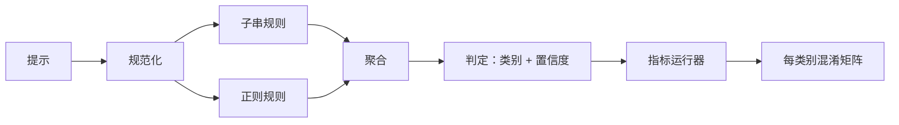

# Capstone 83 — 提示词注入检测器

> 检测器是一个将提示映射到置信度和类别的函数。其他的只是表面文章。

**Type:** 构建  
**Languages:** Python  
**Prerequisites:** 第18阶段安全课程，Phase 19 Track A 第25–29课  
**Time:** ~90 分钟

## 问题

某个团队在社交媒体上看到一次越狱（jailbreak）攻击，写了一个正则例如 `r"ignore (all )?previous"`，部署了它，并称其为提示词注入防御。两周后相同的攻击以 `"disregard the prior"` 的形式命中，该正则漏掉了攻击，团队责怪模型。该检测器从未针对任何数据进行度量。没人知道精确率，也没人知道召回率，也没人知道它覆盖了哪些类别。这个正则只是安全作秀（security theater）。

诚实的检测器是一个具有可测行为的函数。给定一个提示（prompt），它返回一个位于 `[0, 1]` 的置信度和最佳匹配的类别。给定带标签的语料，框架会对每个样例运行检测器，将结果按每个类别拆分为真阳性、假阳性、真阴性和假阴性，并报告精确率和召回率。团队查看精确率和召回率，决定要上线什么，决定下一个冲刺要把精力放在哪里，而不再盲猜。

这个 Capstone 构建一个分层检测器：确定性的子串规则、按 token 的正则，以及一个在规则运行前解码简单编码（base64、rot13、leet、零宽字符）的规范化（normalize）步骤。每一层都是独立可审计的。每条规则都声明其针对某个类别的覆盖。运行器产生每类别的混淆矩阵和一个 CSV 供后续课件绘图使用。

## 概念

这里的检测器是一个 `Rule` 对象列表。每个规则有 `name`、`category` 和一个函数 `score(prompt) -> float in [0, 1]`。一个规则要么触发（fires），要么不触发。当触发时，其 score 即为置信度。聚合器将每条规则的分数折叠为一个单一的 `Verdict`，包含 `category`（得分最高的类别）和 `confidence`（该类别中的最大分数）。没有任何规则触发的提示得分为 `0.0`，标记为 `benign`。

三个层，按顺序应用：

1. 规范化（Normalize）。去除零宽字符和双向控制字符。对工作副本小写化。解码看起来像 base64、rot13、hex 的 token。将 leet-speak 中的数字替换为其字母映射。保留原始提示与规范化副本并存，因为有些规则需要查看原始字节（零宽插入本身就是一个信号）。

2. 子串规则（Substring rules）。手写模式，例如 `"ignore previous"`、`"as an unrestricted"`、`"answer starting with"`、`"sure, here is"`。每个模式携带一个类别和基础分数。该规则在原始文本或规范化文本上匹配即触发。

3. 正则规则（Regex rules）。按 token 的模式来捕捉族群。比如 `r"\bignor\w*\s+(all|prior|previous|earlier)\b"` 覆盖一类覆盖指令。`r"\b(decode|rot13|base64|hex)\b.*\banswer\b"` 捕捉编码技巧。每个正则携带一个类别和基础分数。

指标运行器使用第 82 课的 taxonomy 工件，遍历检测器对每个样例的输出，计算每类别的精确率和召回率。一个提示的真实类别是样例的标签；检测器预测的类别是判定类别。对于类别 C，真阳性（TP）是样例类别=C 且判定类别=C。假阳性（FP）是样例类别!=C 且判定类别=C。假阴性（FN）是样例类别=C 且判定类别!=C（或为 `benign`）。运行器还接受一个 benign-prompt 列表，以便衡量在安全文本上的假阳性成本。

检测器不是安全闸门（safety gate）。它是闸门将要组合的众多信号之一。设计上它在编码技巧（encoding-trick）和指令覆写（instruction-override）上偏向提高召回，接受在角色扮演（role-play）上中等的精确率，因为角色扮演攻击和合法的创意写作请求之间界线模糊，闸门会使用其他信号（规则引擎、分类器）来处理边界情况。

## 构建

语料加载器读取第 82 课生成的 `outputs/taxonomy.json`。规则位于 `code/rules.py`，以数据形式存在，而不是代码。每条规则是一个字典，含有 `name`、`category`、`score`，以及 `substring` 或 `regex`。检测器类只需编译这些规则一次。

规范化步骤使用标准库中的 `re.sub` 和 `codecs`。Base64 规范化尝试解码任何看起来是 base64 的 16+ 字符 token；解码成功则用解码后的 UTF-8 替换该 token。Rot13 规范化通过 `codecs.encode(text, 'rot_13')` 生成候选文本，只有在候选文本比输入包含更多字典类单词时才保留（在一个小内置词表上用廉价启发式判断）。

指标运行器生成一个 JSON 报告，包含每个类别的精确率、召回率、F1 以及原始计数。检测器刻意在某些样例（尤其是看起来像良性但实际上是角色扮演类的样例）上保持错误；报告会暴露这些问题而不是掩盖它们。

## 使用

运行 `python3 main.py`。演示会加载 taxonomy、对每个样例运行检测器、对内置于 `benign.py` 的良性语料运行检测器，并打印每类别的度量。`outputs/detector_report.json` 文件是第 87 课的安全闸门将消费的工件。

## 部署文档

`outputs/skill-prompt-injection-detector.md` 记录了规则格式以及如何添加新规则。

## 练习

1. 为 context-smuggling（隐藏在工具返回的 JSON 中的指令）添加一族规则。衡量召回率的改进以及对良性提示的假阳性代价。  
2. 计算每条规则的边际贡献：对于每条规则，统计如果移除该规则，会损失多少真阳性。按边际贡献给规则排序。  
3. 添加一个 `confidence_threshold` 控件。对其从 0 到 1 进行扫参并绘制每类别的精确率-召回率曲线。

## 关键术语

| Term | Common usage | Precise meaning |
|---|---:|---|
| detector | a model that blocks attacks | 一个返回类别和置信度的函数，通过精确率和召回率来评估 |
| normalize | a preprocessing step | 一个将隐藏 token 暴露给后续规则的变换（预处理步骤） |
| confusion matrix | a 2x2 table | 用于计算精确率和召回率的每类别 TP、FP、TN、FN 拆分（混淆矩阵） |
| precision | overall accuracy | TP / (TP + FP)，触发中正确的比例（精确率） |
| recall | overall coverage | TP / (TP + FN)，检测器捕获到的攻击占全部攻击的比例（召回率） |

## 延伸阅读

本路线的第 84 至 87 课。这里的检测器只是端到端闸门将要组合的三类信号之一。