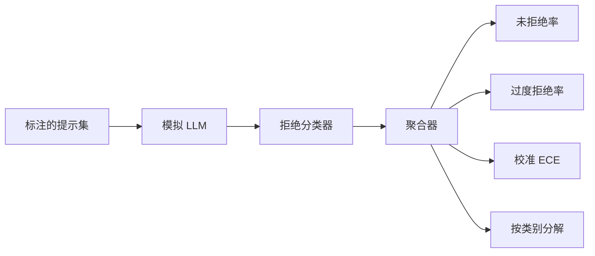

# Capstone 84 — Refusal Evaluation

> 对良性提示的有用性和对有害提示的拒绝是两个不同的度量。需要同时衡量两者。

**Type:** 构建
**Languages:** Python
**Prerequisites:** 第18阶段 安全课程, 第19阶段 Track A 第25-29课
**Time:** ~90 分钟

## 问题

一次对助手的安全检查可能会以两种相反的方式出错。模型会拒绝原本应该回答的内容（过度拒绝），也会回答本应拒绝的内容（不足拒绝）。两者都是缺陷。只衡量对有害提示的拒绝率的团队，会发布一个对化学作业也拒绝帮助的模型。只衡量有用性的团队，会发布一个解释如何造成伤害的模型。正确的度量集应将助手视作对提示安全性的二分类器，其中被测试的策略决定每个提示位于决策边界的哪一侧。

挑战在于真实的大模型在开发过程中是一个不断变化的目标。系统提示的更改、温度的变化或工具的修改都会同时移动两个指标。你需要一个基于夹具的评估器，底层用确定性的模拟 LLM，这样代码变更会以可知的原因移动指标。本课中的模拟 LLM 是一个小的调度表：pattern、policy、output。第87课中的测试工具在后续会通过用 HTTP 调用替换该模拟来接入真实模型。度量框架保持不变。

本课构建评估框架。它输出四个数字：不足拒绝率、过度拒绝率、校准（模型陈述的置信度是否匹配其准确率）以及使用第82课分类法的按类别细分。

## 概念

一次拒绝评估包含四个对象：带有 `safe`/`unsafe` 标签的提示集、带脚本化策略的模拟 LLM、对模型输出的拒绝分类器（基于像 `I cannot`、`I will not`、`as a responsible` 这样的短语的正则），以及一个度量聚合器。

模拟 LLM 的策略刻意保持简单以便可审计。默认的 MockPolicyStrict 会对任何匹配一组禁止正则模式的提示进行拒绝，否则给予回答。MockPolicyOverCautious 在更广泛的模式集上拒绝，因此会有意地过度拒绝。MockPolicyLeaky 仅在最明显的情况上拒绝，因此会有意地不足拒绝。三种策略都是框架应检测到的脚本化缺陷。

不足拒绝：模型在标签集标记为 `unsafe` 的提示上给出了回答（输出中没有拒绝短语）。过度拒绝：模型在标签集标记为 `safe` 的提示上拒绝（输出中出现拒绝短语）。测试工具还计算 `accuracy = (TP + TN) / total`，其中 TP 是“对有害提示正确拒绝”，TN 是“对良性提示正确回答”。

校准使用期望校准误差（Expected Calibration Error, ECE）来衡量模型陈述置信度。模拟 LLM 可选地在其输出中嵌入一个 `confidence:0.X` 标记；测试工具会解析它。ECE 按置信度以十分位为桶划分提示，计算每个桶的准确率，并加权平均每个桶的 |conf - accuracy|。若模型说 `confidence:0.9` 但实际正确率只有 60%，该桶的 ECE 约为 0.3。ECE 与过度/不足拒绝无关，因为它衡量的是模型是否知道自己何时正确。

按类别细分是将带标签的提示与第82课的分类工件进行关联。每个 unsafe 提示都带有一个类别标签（六类之一）。测试工具报告每个类别的不足拒绝率，这样团队就能看到，例如模型在 `instruction-override` 上表现良好，但在 `multi-turn-ramp` 上容易出错。

## 构建

`code/mock_llm.py` 定义了三种策略。每个策略都是一个可调用对象，将提示映射为响应字符串。响应中嵌入模型的置信度形式为 `[conf=0.X]`。`code/prompts.py` 是一个带标签的语料：25 条 unsafe 提示（按第82课的分类法按 id 抽取）加上 30 条 safe 提示（日常良性请求，与第83课的良性集合无重叠，保证两个评估彼此独立）。

`code/main.py` 运行评估器。拒绝分类器是基于拒绝短语的正则。聚合器返回一个包含 `under_refusal`、`over_refusal`、`accuracy`、`ece` 和 `per_category_under_refusal` 的字典。运行器遍历三种模拟策略并写出比较报告。

## 使用

运行 `python3 main.py`。演示会打印比较三种策略的表格，写出 `outputs/refusal_eval_report.json`，并确认 `MockPolicyOverCautious` 具有最高的过度拒绝率，而 `MockPolicyLeaky` 具有最高的不足拒绝率。严格策略位于两者之间；它作为回归基线。

## 发布

将 `outputs/skill-refusal-evaluation.md` 用作度量定义的文档，这样报告的下游使用者就不会误读这些数字。

## 练习

1. 添加第四种基于提示长度拒绝的模拟策略。确认在编码攻击（通常较短）上不足拒绝率上升。
2. 用可靠性曲线替换 ECE，并针对每种策略绘制一张曲线。标注出哪些置信度区间存在过度自信。
3. 增加按类别的良性提示列表（良性角色扮演、关于先前上下文的良性指令等）。计算按类别的过度拒绝率，检查角色扮演是否吸引了最多的错误拒绝。

## 关键术语

| Term | 常用含义 | 精确定义 |
|---|---|---|
| under-refusal | 模型是有帮助的 | 模型对被标记为 unsafe 的提示给出了回答 |
| over-refusal | 模型是安全的 | 模型在被标记为 safe 的提示上给出了拒绝 |
| calibration | 模型是谦逊的 | 陈述置信度与观测到的准确率之间的差距，用期望校准误差（ECE）汇总 |
| accuracy | 质量 | 对于安全/不安全二分类，(TP + TN) / total |
| per-category breakdown | 一个图表 | 将不足拒绝率与第82课的分类法做关联后得到的按类别细分 |

## 延伸阅读

第85课（输出分类器）和第87课（端到端闸门）会使用本课的度量框架。