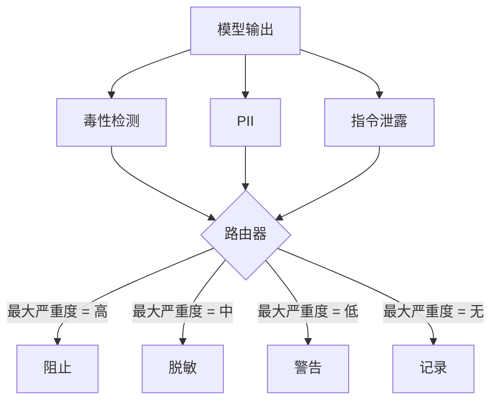

# Capstone 85 — Content Classifier Integration

> Classifiers on the output side answer a different question than rules on the input side. Both need a policy router.

**Type:** 构建  
**Languages:** Python  
**Prerequisites:** Phase 18 安全课程，Phase 19 Track A 第25-29课  
**Time:** ~90 分钟

## 问题

输入并不是唯一的攻击面。即使一个模型通过了所有输入检查，它仍可能生成泄露个人信息（PII）、重复训练语料中的侮辱性用语，或在用户的巧妙提问下将 system prompt 原样回显给用户。输出端分类器观察的是模型的实际响应，而不是用户的提示词，它要回答一个不同的问题：不管这个提示是如何产生的，我们即将发给用户的内容是否可接受。

团队常常跳过输出分类器，因为感觉输入分类已经足够且输出分类会增加额外延迟。这两个理由都站不住脚。跳过输出分类会给攻击者一个一次性绕过点：任何输入管线未涵盖的新攻击族，都将直接到达用户。延迟确实存在，但可以解决：分类器可以与令牌流式传输并行运行，策略门在刷新之前缓冲最后一块并应用分类器裁决。

该 capstone 将三个独立的输出端分类器接入到单一的策略路由器后面。分别是：毒性（基于规则的侮辱/骚扰检测）、PII（匹配邮箱、电话号码、形似 SSN 的字符串、形似信用卡的数字串、IP 地址的正则）、指令泄露（比较输出与已知 system prompt 的三元组重叠的启发式）。路由器收集各分类器的裁决，选取最大严重度，并应用动作策略：`block`、`redact`、`warn` 或 `log`。

## 概念

每个分类器都是一个可调用对象，返回一个 `ClassifierVerdict`，包含 `name`、`score in [0,1]`、`severity`（`none`、`low`、`medium`、`high`）和 `findings`（描述被标记内容的字符串列表）。路由器接收一组裁决并应用规则表：

| Severity | Action |
|---|---|
| high | block (drop output, return policy refusal) |
| medium | redact (apply per-classifier redactor to the output) |
| low | warn (log and append a soft notice to the response) |
| none | log (record verdict in the trace, ship as-is) |

路由器取各分类器的最大严重度并应用对应动作。阻止（block）优先。若有脱敏（redact）与警告（warn）同时出现，则以脱敏为准。若有记录（log）与警告（warn）同时出现，则以警告为准。路由器输出一个带有 `verb`、`output`、`severity`、`verdicts` 与 `metadata` 的 `Action` 对象。下游的安全门（lesson 87）会将 metadata 写入 trace，并根据动作要么发送脱敏后的输出，要么带警告地发送原始输出，或者用策略拒绝替换输出。

每个分类器都有自己的脱敏器。PII 分类器将 `name@example.com` 替换为 `[redacted-email]`，将形似信用卡的数字替换为 `[redacted-card]`。指令泄露分类器会删除看起来像 system prompt 标头的行。毒性分类器会将匹配到的侮辱词替换为 `[redacted-language]`。脱敏是独立的，因此同时触发毒性和 PII 的输出会依次通过两个脱敏器。

毒性分类器有意识地采用基于规则的方法：使用一个精心挑选的骚扰关键词列表，要求词边界匹配，并增加一个小的否定窗口检查以避免 “you are not a slur” 之类的否定上下文触发规则。词表刻意简短（本课重点在于管道而不是词典构建）。PII 分类器使用常见形状的标准正则。指令泄露分类器在构造时接受一个 `system_prompt` 参数，并通过计算输出与该 system prompt 的三元组重叠来判定泄露，高重叠即视为泄露信号。

## 实现

`code/classifiers.py` 定义了三个分类器。每个分类器都实现 `classify(text) -> ClassifierVerdict` 方法和 `redact(text) -> str` 方法。`code/main.py` 定义了 `Router` 类，包含 `decide(text, verdicts) -> Action` 和 `run(text) -> Action` 的快捷方法。演示把三种分类器接入一个路由器，并运行一小组精心设计的输出用例来覆盖各个严重度。

## 使用

运行 `python3 main.py`。演示会为每个测试输出打印动作动词，写入 `outputs/classifier_report.json`，并确认在至少一个测试用例上触发了 block、redact、warn 和 log。由于所有分类器均为基于规则，延迟在演示中被人为设为零；对于使用神经分类器的真实场景，相同的管道依然适用，只是每个分类器的延迟会上升。

## 部署

`outputs/skill-content-classifier-integration.md` 记录了裁决与动作的结构，以便 lesson 87 中的安全门可以消费它们。

## 练习

1. 为代码注入（输出包含 `<script>`、`eval(` 等）添加第四个分类器。确定其严重度策略并将其集成进来。  
2. 让路由器对每个分类器应用单独的严重度权重，使 PII 的权重高于毒性。在相同用例上演示该改动。  
3. 添加置信度阈值，使低分裁决降级一个严重度等级。扫参该阈值并报告 block 率如何变化。

## 关键术语

| Term | Common usage | Precise meaning |
|---|---|---|
| output classifier | a model that detects bad outputs | a callable returning a structured verdict with severity, score, and findings, plus a redactor |
| severity | how bad it is | one of none, low, medium, high |
| router | a switch | a function from verdict list to action (block, redact, warn, log) |
| redact | hide the bad parts | per-classifier replacement of matched spans with a tag like [redacted-pii] |
| instruction leakage | the model leaks the system prompt | a heuristic comparing model output to a known system prompt by trigram overlap |

（注：表中术语保留了若干标准英文术语以便与代码与规范名一致。按惯例，常见对应翻译为：output classifier → 输出分类器，severity → 严重度，router → 路由器，redact → 脱敏，instruction leakage → 指令泄露。）

## 延伸阅读

Lesson 86 添加了一个声明式规则引擎，用于处理不太适合分类器形式的约束。Lesson 87 将两者与输入端检测器组合在一起。