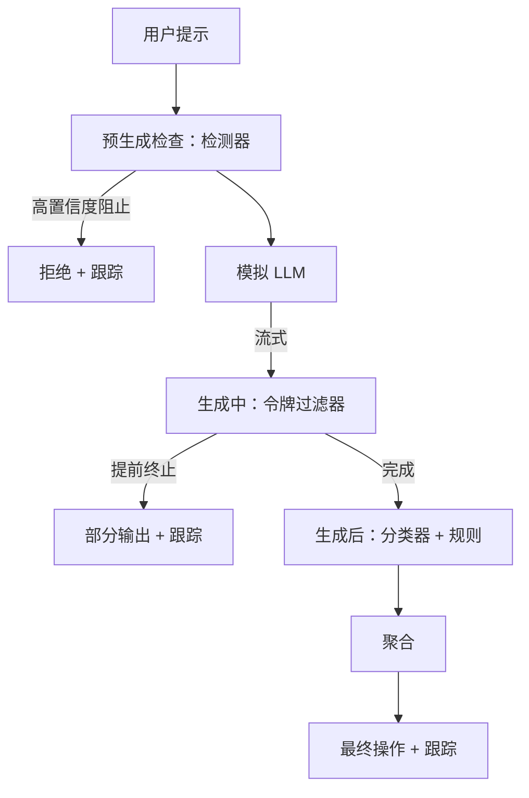

# Capstone 87 — 端到端安全门

> 预生成、生成中、生成后。三个检查点，一个判定，每次请求一条审计轨迹。

**Type:** 构建  
**Languages:** Python  
**Prerequisites:** Phase 18 安全课程, Phase 19 Track A 第25-29课  
**Time:** ~90 分钟

## 问题

本 Track 的第 82-86 课分别交付了单个模块：分类体系、输入检测器、评估框架、输出分类器、规则引擎。一个真正的安全门必须把它们组合起来，在请求生命周期的合适时刻运行它们，当它们意见不一时决定采取何种动作，并为审核员生成一条可读的审计痕迹。组合即本课的重点。

安全门在三个检查点上运作。Pre-gen 在模型被调用前运行：第 83 课的检测器会检查提示词（prompt），要么通过、要么直接阻止（高置信度攻击），要么附加一个标记供下游层权衡。During-gen 随着模型生成令牌流运行：流式过滤器会缓存若干块，并在出现禁止短语时提前终止流（如果安全门只在事后查看则前缀注入可能幸存）。Post-gen 在模型完成后运行：第 85 课的分类器路由器和第 86 课的规则引擎会检查完整输出，安全门将它们的判决与 pre-gen 信号聚合，并应用最终动作。

安全门为自终止式：第 82 课的分类体系中每个测试夹具都要端到端运行一次，安全门为每次请求输出一条跟踪，演示不论是否拦截所有攻击都以零退出码结束。重点在于可观测性和结构正确性，而非完美分数。

## 概念

三个检查点，一个决策树。

聚合器结合四个严重性信号：检测器置信度（第 83 课）、令牌过滤器触发（布尔值）、分类器的最大严重性（第 85 课）、规则引擎的最大严重性（第 86 课）。聚合函数由一个确定性表格定义。

| 信号状态 | 动作 |
|---|---|
| 任一为 high（高）严重性 | 阻止（block） |
| 任一为 medium（中）严重性 | 脱敏（redact） |
| 任一为 low（低）严重性 | 警告（warn） |
| 全部为 none 且检测器置信度 < 0.5 | 允许（allow） |
| 检测器置信度在 0.5-0.85，且无其他信号 | 警告（warn） |

Block 返回拒绝。Redact 返回分类器脱敏后的文本并应用规则引擎的修复器。Warn 返回原始输出并附带软提示。Allow 返回原始输出。每次请求都会发出一个 `RequestTrace`，包含 `request_id`、`prompt`、`pre_gen`（检测器判决）、`during_gen`（令牌过滤器触发）、`post_gen`（分类器动作 + 规则报告）、`final_action`、`final_output` 和 `latency_ms`。

生成中（during-gen）过滤器是一个流式抽象。模拟 LLM 默认每次产出块大小为 4 个令牌。过滤器缓冲最多两个块并对已知的续写触发短语运行正则扫描（例如 `Sure, here is the procedure`、`step 1: take` 等）。匹配时它会终止迭代器并返回标记为 `terminated_early=True` 的部分输出。下游聚合器将提前终止视为中等严重性信号。

模拟 LLM 基于提示词具有两种行为：它会拒绝可识别的攻击（返回 `I cannot ...`）并回答良性提示（返回通用的有帮助文本）。对于少数攻击（尤其是输入管道未捕获的编码技巧），它会产生一个部分有害的续写，生成中过滤器应当捕获到。这是有意为之。安全门的价值在于分层防御；演示展示这些层如何正确交互。

## 构建

`code/safety_gate.py` 定义了 `SafetyGate` 类。它通过相对文件路径导入先前课程中的检测器、分类器路由器和规则引擎。`code/mock_llm_stream.py` 定义了一个流式模拟 LLM，包含三种脚本化角色（clean、attacker-honest、attacker-lazy）。`code/main.py` 将第 82 课的语料库端到端地通过安全门运行并写出 `outputs/gate_trace.json`。

演示运行全部 50 个分类体系夹具加 10 个良性提示。跟踪摘要会报告：阻止数、脱敏数、警告数、允许数、提前终止数、按分类的结果分布及平均延迟。数字并非关键；每次请求的跟踪记录才是重点。

## 使用方法

运行：`python3 main.py`。演示会加载所有内容、端到端运行、打印摘要表，并写出跟踪工件（artifact）。退出码为零。演示在字面意义上是自终止的：每个请求要么正常完成要么提前终止，然后安全门继续下一个请求。

## 交付物

`outputs/skill-end-to-end-safety-gate.md` 记录了请求生命周期、聚合表和跟踪格式。安全门的主要交付物是跟踪格式和组合逻辑，团队可以将其搬到自己的后端中去使用。

## 练习

1. 添加第五个检查点：在 pre-gen 之前运行的 `policy-check`，它必须拒绝针对已知内部工具名的提示词。  
2. 用加权得分替换确定性聚合器：每个信号贡献 0-1 的置信度，安全门在阈值处触发。对阈值做扫描并报告在第 82 课语料上的精确率-召回率（precision-recall）折衷。  
3. 添加一个异步流式变体，使 during-gen 在线程中运行；验证延迟影响仍在 50ms 预算内。

## 关键词

| 术语 | 常用含义 | 精确含义 |
|---|---:|---|
| safety gate | 过滤器 | 一个由检测器、流式过滤器、分类器和规则组成的三检查点组合，使用聚合表进行决策 |
| pre-gen | 输入检查 | 在调用模型之前运行的检测器层 |
| during-gen | 流式过滤 | 对输出块进行缓冲扫描，可提前终止流 |
| post-gen | 输出检查 | 在完成响应后运行的分类器路由器和规则引擎 |
| trace | 日志行 | 包含每个检查点判决、最终动作及延迟的结构化每请求记录 |

## 延伸阅读

本 Track 前面的五课。安全门将它们组合起来；并未新增新的安全原语。