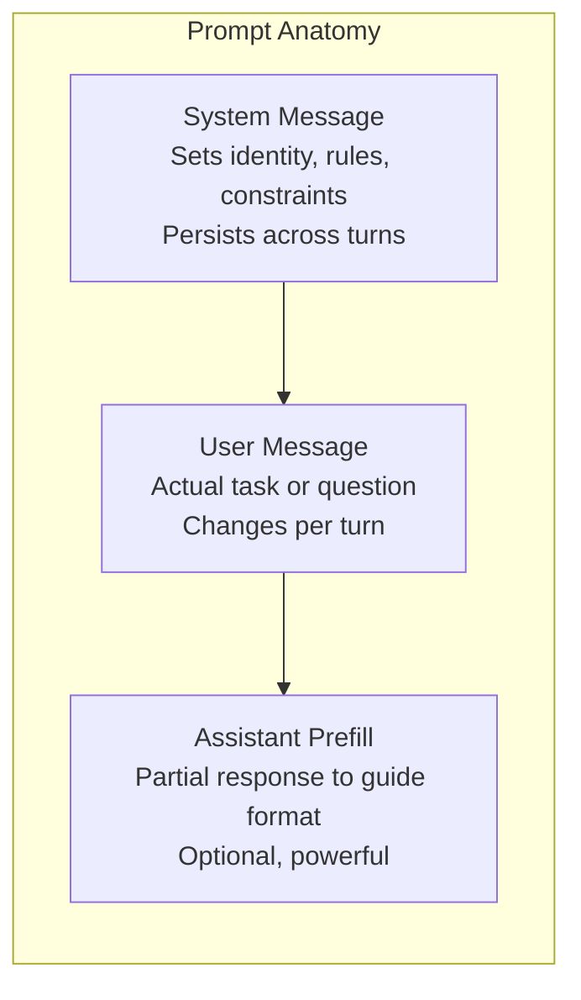

# Prompt Anatomy

### Core Mechanism
Every LLM API call consists of three primary components that dictate how the model processes instructions and generates outputs:
1. **System Message**: Sets the model's identity, behavioral constraints, and output rules. It is treated as the highest priority context. Adherence varies by model: Claude has the strongest adherence; GPT-5 may drift in long conversations; Gemini treats it as a separate `system_instruction` field.
2. **User Message**: The actual task or query. Without a robust system message, the user message is often under-constrained.
3. **Assistant Prefill**: A technique where the developer pre-populates the beginning of the assistant's response (e.g., starting with `{"role": "assistant", "content": "```json\n{"`). This forces the model to continue from that point, bypassing conversational preambles.

### Examples/Templates


### Parameters/Caveats
* **Model Differences**: Anthropic natively supports Assistant Prefill. OpenAI does not support native prefill and recommends using their Structured Outputs API instead.

## Outgoing Links
- [[prompt_patterns|Prompt Patterns]]
- [[assistant_prefill|Assistant Prefill]]
- [[context_window|Context Window]]

## References
- [[index|Wiki Index]]
